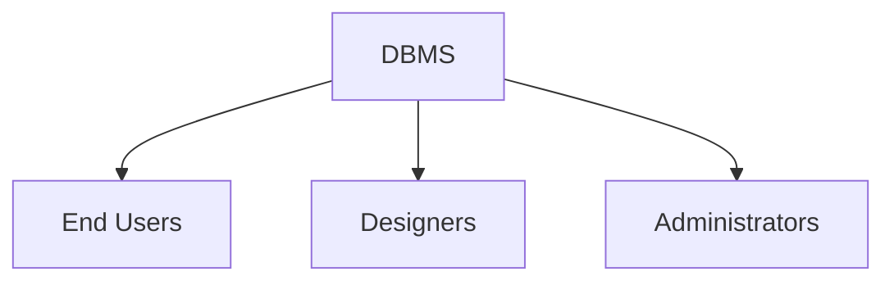

# 📊 **DBMS Overview**

> *“Data is the new oil.”*  
> But raw data alone is useless — it’s the **Database Management System (DBMS)** that refines it into valuable **information**.

## 🔍 What is Data? What is Information?

| Term | Definition | Example |
|------|------------|---------|
| **Data** | Raw, unprocessed facts & figures. | `StudentID: 101`, `Marks: 85`, `Course: Math` |
| **Information** | Processed data with context, meaning, and purpose. | *“Student 101 scored 85 in Math — above class average of 78.”* |

> ✅ A DBMS transforms **data → information** efficiently, securely, and reliably.

## 🔄 Evolution: From File Systems to DBMS

Before DBMS, data was stored in **flat files** — leading to:

- ❌ Redundancy (same data copied across files)  
- ❌ Inconsistency (updates not synchronized)  
- ❌ No concurrency control  
- ❌ Poor security & integrity  
- ❌ Hard to query or scale

👉 **DBMS emerged to solve these problems** — introducing structure, rules, and automation.

## 🧩 Key Characteristics of Modern DBMS

Modern DBMSs are designed around real-world needs. Here’s what makes them powerful:

### 🌍 1. Real-World Entity Modeling
- Models real objects (e.g., *Student*, *Product*, *Order*) as **entities**.
- Captures their **attributes** (e.g., *Age*, *Price*, *Status*) and **relationships** (e.g., *Student enrolls in Course*).

> 🎯 *Example*: School DB → Entities: `Student`, `Teacher`, `Class` → Attributes: `Name`, `Grade`, `Subject`

### 📊 2. Relation-Based Tables
- Data organized into **tables (relations)** with rows (tuples) and columns (attributes).
- Easy to understand: Table names reflect real-world concepts (`Students`, `Orders`, `Inventory`).

> 💡 *A user can “read” the database just by looking at table names.*

### 🧱 3. Isolation of Data & Application
- **Data ≠ Database**  
  - *Data* = Passive storage (the “what”)  
  - *Database* = Active system managing data (the “how”)  
- Stores **metadata** (data about data) — e.g., schema, constraints, indexes — to manage itself.

> 🧠 *Think of metadata as the “blueprint” of your database.*

### 🗑️ 4. Less Redundancy via Normalization
- Uses **normalization** — a mathematically rigorous process — to eliminate duplicate data.
- Splits tables to avoid repeating values (e.g., storing instructor name once, not per course).

> 📉 *Reduces storage waste + prevents update anomalies.*

### ⚖️ 5. Consistency Enforcement
- Ensures database remains in a **valid state** after every transaction.
- Detects and prevents inconsistent states (e.g., negative inventory, orphaned records).
- Superior to file systems, which offer no built-in consistency checks.

### 🗣️ 6. Powerful Query Language (SQL)
- Allows users to **retrieve, filter, join, aggregate** data with precision.
- Supports complex queries: `WHERE`, `GROUP BY`, `HAVING`, `JOIN`, subqueries, etc.

> 💬 *“Show me all students who scored >90 in Math AND are enrolled in Science.”*

### 🛡️ 7. ACID Properties (Transaction Guarantees)
Every transaction must satisfy:

| Property | Meaning |
|----------|---------|
| **A**tomicity | All-or-nothing — if part fails, entire transaction rolls back |
| **C**onsistency | Valid state before and after transaction |
| **I**solation | Concurrent transactions don’t interfere |
| **D**urability | Committed changes survive crashes |

> 🚨 *Critical for banking, e-commerce, healthcare — where data integrity is non-negotiable.*

### 👥 8. Multiuser & Concurrent Access
- Multiple users can read/write simultaneously.
- Built-in **concurrency control** (locking, timestamps) ensures no conflicts.
- Users remain unaware of underlying complexity.

> 🤝 *Like Google Docs — multiple people editing, but no one overwrites each other.*

### 👁️ 9. Multiple Views
- Different users see customized data subsets.
  - Sales team → sees only sales data
  - HR → sees employee records
  - Admin → sees everything

> 🔒 *Enhances usability + security by design.*

### 🔐 10. Robust Security Features
- Role-based access control (RBAC)
- Constraints on data entry (e.g., `CHECK`, `NOT NULL`)
- Encryption, auditing, authentication
- Metadata protection → harder to hack than flat files

> 🕵️ *Even if someone accesses the system, they can’t see what they’re not authorized for.*

## 👥 Who Uses a DBMS? (User Roles)

A typical DBMS serves different types of users — each with distinct roles and permissions:

### 🧑‍💼 1. **End Users**
- Interact with the system via applications or simple queries.
- Types:
  - **Naive Users**: Use pre-built apps (e.g., bank teller entering deposits)
  - **Sophisticated Users**: Write custom queries (e.g., analysts running reports)

### 🧑‍💻 2. **Designers**
- Design the database schema (tables, relationships, constraints).
- Define views, indexes, and security policies.
- Often work with ER diagrams and normalization rules.

### 👨‍💼 3. **Administrators (DBAs)**
- Manage the DBMS software, hardware, and performance.
- Handle backups, recovery, security, and user access.
- Monitor system health and optimize queries.

> 🛠️ *DBAs are the “guardians” of the database — ensuring uptime, speed, and safety.*

## 📈 Why DBMS Matters Today

✅ **Scalability** – Handles millions of records & concurrent users  
✅ **Reliability** – ACID guarantees data integrity  
✅ **Security** – Fine-grained access control & encryption  
✅ **Efficiency** – Optimized storage, indexing, and querying  
✅ **Maintainability** – Centralized management + metadata-driven design  

> 🌐 Used everywhere: Banking, Healthcare, E-commerce, Social Media, IoT, AI/ML pipelines…

📌 **Quick Recap (Memory Hook):**

> **“DBMS = Data + Structure + Security + Simplicity”**  
> It turns chaos into clarity — one table at a time. 📊✨

