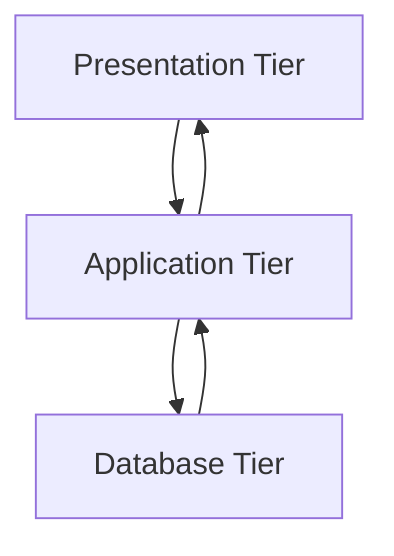

# 🏗️ **DBMS – Architecture**

> *“Architecture is the blueprint of a system — and in DBMS, it determines how data flows, who accesses it, and how scalable or secure it becomes.”*

The **design of a DBMS** depends heavily on its **architecture** — whether centralized, decentralized, or hierarchical. It can also be categorized as **single-tier, two-tier, or multi-tier**, where each tier handles a specific responsibility.


## 🧱 What is DBMS Architecture?

It’s the **structural framework** that defines:

- How users interact with the database
- Where data is stored & processed
- How applications communicate with the DBMS
- How scalability, security, and maintainability are achieved

> 💡 *Think of it like building a house:*
> - Foundation = Database Tier  
> - Walls & Rooms = Application Tier  
> - Front Door & Windows = Presentation Tier  


## 🔢 Types of DBMS Architecture

### 1️⃣ **Single-Tier Architecture (1-Tier)**

```plaintext
[ User ] ↔ [ DBMS ]
```

- **All components reside on one machine.**
- User interacts **directly** with the DBMS.
- No separate application layer.
- Changes affect the DBMS directly → risky for production systems.

✅ **Use Case**:  
- Small local databases (e.g., SQLite for mobile apps or personal projects)  
- Developers testing logic without abstraction

⚠️ **Drawbacks**:  
- No separation of concerns  
- Hard to scale or secure  
- No user-friendly interfaces

> 👨‍💻 *Preferred by designers & programmers for quick prototyping.*


### 2️⃣ **Two-Tier Architecture (2-Tier)**

```plaintext
[ User ] ↔ [ Application ] ↔ [ DBMS ]
```

- **Application Layer** sits between user and DBMS.
- User interacts via an app (desktop/web/mobile).
- DBMS runs independently — often on a server.
- Application handles business logic; DBMS handles data storage.

✅ **Use Case**:  
- Traditional client-server apps (e.g., old ERP systems, desktop banking software)

🎯 **Advantages**:  
- Better separation than 1-tier  
- Easier to manage access control  
- Can handle multiple clients

⚠️ **Limitations**:  
- Application layer may become bloated  
- Scaling requires duplicating entire app + DB setup

> 💬 *Example*: A Java Swing app connecting directly to MySQL via JDBC.


### 3️⃣ **Three-Tier Architecture (3-Tier)** — ✅ **Most Popular Today**



> 🌐 *Used in modern web apps, cloud platforms, enterprise systems.*

#### 🟡 **Tier 1: Presentation (User) Tier**
- Where end-users interact with the system.
- Could be:
  - Web browser (HTML/CSS/JS)
  - Mobile app
  - Desktop GUI
- Users see **views**, not raw tables.
- Multiple views possible (Sales vs HR dashboard).

> 👁️ *Users don’t know or care about the underlying DB — they just use the interface.*


#### 🟠 **Tier 2: Application (Middle) Tier**
- Contains **business logic**, APIs, services, and middleware.
- Processes requests from UI → translates them into DB queries.
- Acts as **mediator** between user and database.
- Often runs on application servers (e.g., Node.js, Django, Spring Boot).

> ⚙️ *This tier abstracts complexity — e.g., “Show me my orders” → SQL query → formatted JSON response.*


#### 🟢 **Tier 3: Database (Data) Tier**
- Stores actual data + metadata + constraints.
- Handles:
  - Query processing (SQL parsing, optimization)
  - Transaction management (ACID)
  - Indexing, locking, recovery
- Runs on dedicated database servers (MySQL, PostgreSQL, Oracle, MongoDB).

> 🗃️ *The “brain” of the system — ensures data integrity, performance, and durability.*


## 🔄 Why 3-Tier? The Power of Separation

| Benefit | Explanation |
|--------|-------------|
| ✅ **Modularity** | Each tier can be developed, tested, deployed independently |
| 🔄 **Scalability** | Scale app tier horizontally (add more servers); scale DB tier vertically/horizontally |
| 🔐 **Security** | Hide DB behind app layer — users never connect directly |
| 🛠️ **Maintainability** | Fix bugs or upgrade one tier without affecting others |
| 👥 **Multiple Views** | Same data → different UIs for different roles (admin, customer, analyst) |

> 📈 *Used by Facebook, Amazon, Netflix, banks, hospitals — anything needing high availability and flexibility.*


## 🖼️ Visual Summary: 3-Tier Architecture

```
┌──────────────────────┐
│   🖥️ Presentation    │ ← End Users (Web/Mobile/Desktop)
└──────────┬───────────┘
           ↓ ↑
┌──────────────────────┐
│   ⚙️ Application     │ ← Business Logic, APIs, Security
└──────────┬───────────┘
           ↓ ↑
┌──────────────────────┐
│   🗃️ Database        │ ← Data Storage, Queries, Transactions
└──────────────────────┘
```

> 🔄 Arrows show bidirectional communication — requests flow down, results flow up.


## 🆚 Comparison Table: 1-Tier vs 2-Tier vs 3-Tier

| Feature             | 1-Tier                     | 2-Tier                          | 3-Tier                                  |
|---------------------|----------------------------|----------------------------------|------------------------------------------|
| Complexity          | Low                        | Medium                           | High                                     |
| Scalability         | Poor                       | Moderate                         | Excellent                                |
| Security            | Weak                       | Medium                           | Strong                                   |
| Maintenance         | Difficult                  | Manageable                       | Easy (modular)                           |
| Best For            | Local dev / small apps     | Internal tools / legacy systems  | Enterprise, web, mobile, cloud apps      |
| Real-World Example  | SQLite on laptop           | Desktop CRM connecting to SQL Server | Online shopping site (React + Node + PostgreSQL) |


## 🚀 Modern Variants: N-Tier & Cloud Architectures

While 3-tier is standard, many systems now use **N-tier** or **microservices-based** architectures:

- **N-Tier**: Add more layers (e.g., caching tier, message queue tier, analytics tier)
- **Cloud-Native**: Use managed DBaaS (e.g., AWS RDS, Azure SQL, Firebase)
- **Serverless**: Functions trigger DB operations (e.g., AWS Lambda + DynamoDB)

> 🌩️ *In cloud environments, tiers may run on different VMs, containers, or serverless functions — but the logical separation remains.*


## 💡 Pro Tip: When to Choose Which Architecture?

| Scenario | Recommended Architecture |
|----------|---------------------------|
| Personal project / learning | 1-Tier (SQLite) |
| Small business app | 2-Tier (Desktop App + Local DB) |
| Web/mobile app with many users | 3-Tier (Frontend + Backend API + DB Server) |
| Enterprise-scale system | N-Tier + Microservices + Cloud DB |


📌 **Quick Memory Hook:**

> **“3-Tier = User → App → Data”**  
> Like ordering food:  
> - You (Presentation) → Waiter (Application) → Kitchen (Database)  
> You don’t cook — you just enjoy the meal. 😊🍽️

