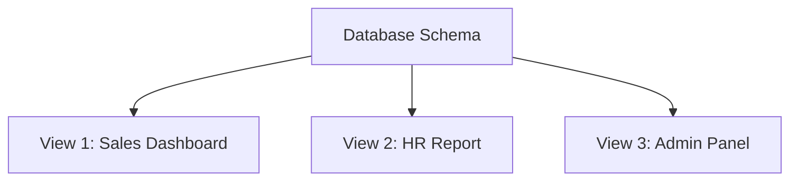

# 📐 **DBMS – Data Schemas**

> *“A schema is the blueprint of a database — it defines the structure, not the content. Like architectural plans before building a house.”*

While **data models** define *how* to think about data (e.g., ER or Relational), **schemas** define *what* the actual structure looks like — tables, columns, constraints, views — in code or diagram form.


## 🧱 What is a Database Schema?

> ✅ **Definition**:  
> A **database schema** is the **logical structure** that defines:
> - What entities exist
> - How they relate
> - What constraints apply (e.g., NOT NULL, UNIQUE, FOREIGN KEY)
> - How data is organized into tables, views, indexes, etc.

> 📌 **Key Point**:  
> It’s **static** — designed *before* the database exists. Once live, changing it can be risky!

> 🖼️ *Schema diagrams* are visual representations — used by designers and developers to understand the system.


## 🔁 Schema vs Instance: The Critical Difference

| Term | Definition | Changes Over Time? | Contains Data? |
|------|------------|---------------------|----------------|
| **Schema** | Structure / Blueprint | ❌ Rarely (hard to change) | ❌ No — only metadata |
| **Instance** | Snapshot of data at a point in time | ✅ Constantly (inserts, updates, deletes) | ✅ Yes — actual records |

> 💡 Think of it like:
> - **Schema** = Car blueprint (engine layout, seat positions, wheel size)  
> - **Instance** = Actual car on the road — color, mileage, passenger count may vary

> ⚠️ **DBMS ensures every instance conforms to the schema** — via constraints, triggers, and validation rules.


## 🗃️ Two Main Types of Schemas

### 1️⃣ **Physical Database Schema**
> *“How data is stored on disk — the hardware-level view.”*

- Defines:
  - File organization (heap, sorted, hashed)
  - Index structures (B-trees, hash indexes)
  - Storage allocation (blocks, pages, cylinders)
  - Compression, encryption, partitioning

✅ **Designed by DBAs & system architects**  
✅ **Hidden from end-users** — they don’t need to know if data is stored as B+Tree or heap file.

> 🧩 *Example*:  
> `Students` table → stored as **clustered B+Tree index** on `StudentID` → each row occupies 256-byte blocks → stored across 3 disk sectors.


### 2️⃣ **Logical Database Schema**
> *“What users and applications see — the logical structure.”*

- Defines:
  - Tables (relations) and their attributes
  - Primary/Foreign keys
  - Views (virtual tables)
  - Integrity constraints (NOT NULL, CHECK, UNIQUE)
  - Relationships (via foreign keys)

✅ **Designed by database designers & developers**  
✅ **Used by SQL queries, apps, reports**

> 📋 *Example*:  
> ```sql
> CREATE TABLE Students (
>   Stu_ID INT PRIMARY KEY,
>   Stu_Name VARCHAR(50) NOT NULL,
>   Proj_ID INT,
>   FOREIGN KEY (Proj_ID) REFERENCES Projects(Proj_ID)
> );
> ```


## 👁️ Multiple Views: One Schema, Many Perspectives



> 🔄 Each **view** is a customized subset of the schema — tailored for specific user roles.

| View | Purpose | Example Columns |
|------|---------|------------------|
| **Sales View** | Show revenue per product | `Product`, `SalesAmount`, `Region` |
| **HR View** | Track employee details | `Name`, `Department`, `Salary` |
| **Admin View** | Full access + audit logs | All columns + `LastModifiedBy`, `Timestamp` |

> 🔐 Security benefit: Users only see what they’re allowed to — even if underlying schema has more data.


## 🖼️ Visual Summary: Schema Layers

```
┌──────────────────────┐
│     🖥️ View 1        │ ← Sales Team
├──────────────────────┤
│     🖥️ View 2        │ ← HR Department
├──────────────────────┤
│     🖥️ View 3        │ ← Admin / Developer
└──────────┬───────────┘
           ↓ ↑
┌──────────────────────┐
│   📊 Logical Schema  │ ← Tables, Keys, Constraints
└──────────┬───────────┘
           ↓ ↑
┌──────────────────────┐
│   💾 Physical Schema │ ← Files, Blocks, Indexes
└──────────────────────┘
```

> 🔄 Arrows show how views derive from logical schema → which maps to physical storage.


## 🛠️ Why Schema Design Matters

| Benefit | Explanation |
|--------|-------------|
| ✅ **Consistency** | Enforces rules so data stays valid (e.g., no negative salaries) |
| ✅ **Performance** | Good schema → good indexing → fast queries |
| ✅ **Security** | Views hide sensitive data; constraints prevent invalid entries |
| ✅ **Maintainability** | Clear structure = easier debugging, scaling, team collaboration |
| ✅ **Portability** | Well-designed schema can be migrated across DBMS platforms |

> 💬 *Poor schema design = slow queries, broken apps, frustrated users.*


## 🧪 Real-World Analogy: Building a Library

Imagine designing a **library database**:

| Layer | What It Does |
|-------|--------------|
| **Physical Schema** | Bookshelves are arranged by genre → books are indexed → barcode scanners read location codes |
| **Logical Schema** | Tables: `Books`, `Authors`, `Members`, `Loans` → relationships defined via FKs |
| **Views** | Librarian sees all loans; Student sees only their own; Public sees only available books |

> 📚 *The schema ensures every book has an author, every loan has a member, and no one borrows a non-existent book.*


📌 **Quick Memory Hook:**

> 🧱 **Schema** = Blueprint (structure)  
> 📸 **Instance** = Photo (current state)  
> 👁️ **View** = Custom filter (role-based perspective)

> *“You can’t build a skyscraper without a blueprint — and you can’t build a scalable app without a solid schema.”* 🏙️✨

