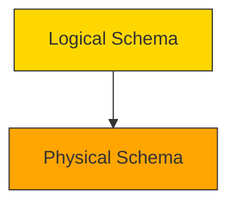

# 🔗 **DBMS – Data Independence**

> *“Data independence is the superpower that lets you change how data is stored or structured — without breaking your apps or confusing your users.”*

In a well-designed DBMS, **changes at one layer shouldn’t force changes at another**. This is made possible by **multi-layered architecture** and **metadata abstraction**.

Without data independence, even upgrading your hard drive could crash your entire system. 😱


## 🧱 Why Multi-Layer Architecture Matters

As we learned earlier:

- DBMS uses **three-tier architecture**:  
  `Presentation → Application → Database`  
- And within the **Database Tier**, we have:  
  `Logical Schema ↔ Physical Schema`

> ✅ **Data independence ensures these layers can evolve independently** — making systems scalable, maintainable, and future-proof.


## 📦 What is Metadata?

> 💡 **Metadata = “Data about data”**

Examples:
- Table names, column types, constraints
- Index structures, file locations, storage formats
- User permissions, view definitions, trigger logic

> 🔄 When metadata changes, it should NOT require rewriting applications or losing data.

> ⚠️ But changing metadata directly is risky — so DBMS uses **abstraction layers** to protect against ripple effects.


## 🎯 Two Types of Data Independence



### 1️⃣ **Logical Data Independence**

> 🧭 *“Change the structure without changing the storage.”*

#### ✅ Definition:
Ability to modify the **logical schema** (tables, relationships, constraints) **without affecting application programs or views**.

#### 🛠️ Example:
You decide to split a `Students` table into `Students` + `Enrollments` for normalization.

Before:
```sql
Students(Stu_ID, Name, Course, Grade)
```

After:
```sql
Students(Stu_ID, Name)
Enrollments(Stu_ID, Course, Grade)
```

➡️ Applications still query `StudentName` via a **view** or **stored procedure** — they don’t care about the underlying table split!

> 🎯 *Goal*: Apps remain unchanged even if DB structure evolves.

#### ❗ Limitation:
Not always 100% possible — e.g., if an app directly references a deleted column.


### 2️⃣ **Physical Data Independence**

> 💾 *“Change the storage without changing the structure.”*

#### ✅ Definition:
Ability to modify the **physical schema** (file organization, indexing, storage devices) **without affecting the logical schema or applications**.

#### 🛠️ Example:
You upgrade from HDD to SSD — or switch from heap files to B+Tree indexing — or move data to cloud storage.

➡️ Your SQL queries (`SELECT * FROM Students`) still work exactly the same!

> 🎯 *Goal*: Hardware/OS/storage changes are invisible to users & apps.

#### 🌐 Real-World Use Case:
Cloud migration — moving from on-prem MySQL to AWS RDS or Google Cloud SQL — without touching application code.


## 🆚 Comparison: Logical vs Physical Data Independence

| Feature | Logical Data Independence | Physical Data Independence |
|--------|---------------------------|----------------------------|
| **Layer Affected** | Logical Schema (tables, keys, constraints) | Physical Schema (files, indexes, storage) |
| **What Changes?** | Table structure, adding/removing columns | Storage format, device, index type |
| **Impact on Apps?** | Should be none (via views/procedures) | Absolutely none |
| **Difficulty** | Harder to achieve (apps may depend on structure) | Easier (apps never touch physical layer) |
| **Example** | Splitting `Employees` into `Employees + Departments` | Replacing HDD with SSD or switching from ISAM to B+Tree |

> 🔄 **Both rely on mapping functions** — the DBMS translates between layers automatically.


## 🖼️ Visual Summary: The Abstraction Layers

```
┌──────────────────────┐
│   🖥️ Application      │ ← Users & Programs (unaware of schema changes)
└──────────┬───────────┘
           ↓ ↑
┌──────────────────────┐
│   📊 Logical Schema   │ ← Tables, Views, Constraints
│   (e.g., CREATE TABLE)│
└──────────┬───────────┘
           ↓ ↑
┌──────────────────────┐
│   💾 Physical Schema │ ← Files, Blocks, Indexes, Storage Devices
└──────────────────────┘
```

> 🔄 Arrows show bidirectional mapping — DBMS handles translation behind the scenes.


## 💡 Why Data Independence is a Game-Changer

| Benefit | Explanation |
|--------|-------------|
| ✅ **Scalability** | Upgrade storage or restructure tables without downtime |
| ✅ **Maintainability** | Fix bugs, optimize performance, add features without rewriting apps |
| ✅ **Portability** | Move database across platforms (MySQL → PostgreSQL) with minimal changes |
| ✅ **Security** | Hide physical details from users — reduces attack surface |
| ✅ **Future-Proofing** | Systems can adapt to new tech (SSDs, cloud, AI-driven indexing) |

> 🧩 *Think of it like driving a car — you don’t need to know how the engine works to press the gas pedal.*


## 🧪 Real-World Analogy: Building a House

Imagine designing a **smart home system**:

| Layer | What It Does | Change Without Breaking System? |
|-------|--------------|----------------------------------|
| **Physical** | Wiring, sensors, HVAC units | ✅ Replace old thermostat with smart one — apps still work |
| **Logical** | Room names, zones, automation rules | ✅ Rename “Living Room” to “Family Room” — voice commands still work |
| **Application** | Alexa/Google Home interface | ❌ If you change voice command syntax, apps break |

> 🏠 *Good design = physical/logical changes don’t affect the user experience.*


📌 **Quick Memory Hook:**

> 🧭 **Logical Independence** = Change *what* you store → Apps don’t notice  
> 💾 **Physical Independence** = Change *how* you store → Everyone stays happy  

> *“Data independence is the silent guardian of stability in a world of constant change.”* 🛡️✨
