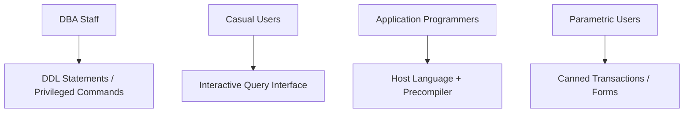
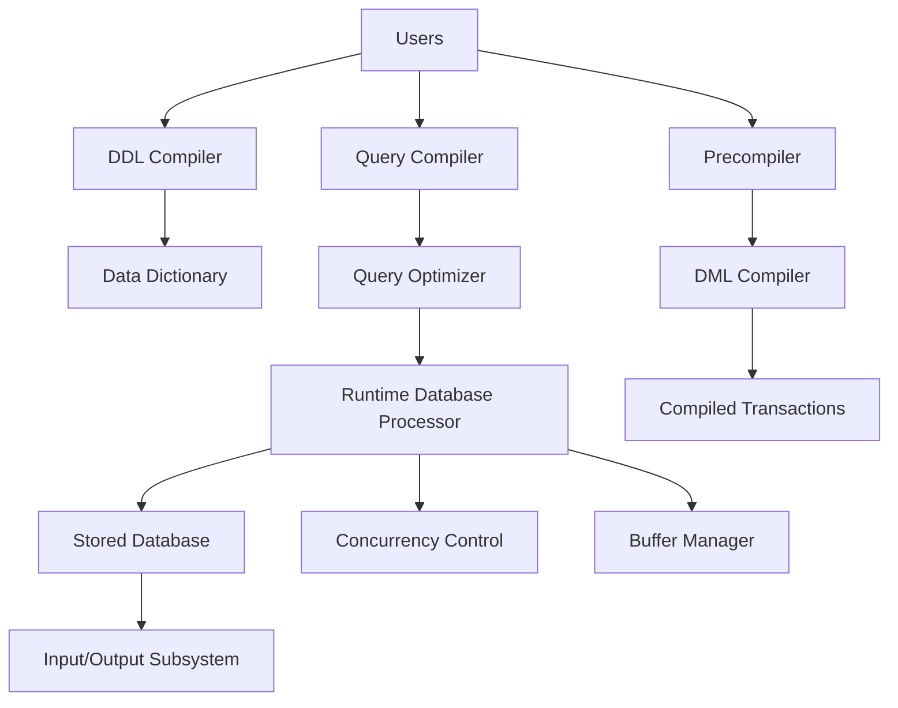

# 🖥️ **DBMS – System Environment**

> *“A DBMS doesn’t live in a vacuum — it thrives in a rich ecosystem of hardware, software, users, and tools. Understanding this environment is key to building robust, scalable, and maintainable systems.”*

Think of the DBMS as the **heart** of an organization — pumping data through veins (networks), feeding organs (applications), monitored by doctors (DBAs), and powered by electricity (OS & hardware).


## 🧭 Overview: What is the DBMS Environment?

The **DBMS environment** includes:

- The **database itself** (data + metadata)
- The **DBMS software** (engine, compilers, optimizers)
- The **operating system** (handles I/O, memory, files)
- **Users** (DBAs, programmers, end-users)
- **Utilities & Tools** (backup, monitoring, CASE tools)
- **Network & Middleware** (for distributed access)

> 💼 Used in:
> - 🛒 E-commerce (product catalogs, carts, payments)  
> - 🏦 Banking (accounts, transactions, loans)  
> - 🏥 Healthcare (patient records, appointments)  
> - 📊 Analytics (dashboards, reports, KPIs)


## 🧱 Core Components of DBMS Environment

### 1️⃣ **Database (The Data Store)**
> 💾 *Where all the data lives — typically on disk drives or SSDs.*

- Contains actual user data + system data (metadata)
- Organized into tables, indexes, logs
- Accessed via DBMS engine — never directly by apps/users

> 🎯 *Example*: Online bookstore → stores `Customers`, `Books`, `Orders`, `Inventory`


### 2️⃣ **DBMS Catalog (Metadata Manager)**
> 🗃️ *“The database about the database.”*

Stores:
- Schema definitions (tables, columns, constraints)
- Index structures
- User permissions
- Storage mappings

> ⚙️ Used by:
> - DDL Compiler → updates schema
> - Query Optimizer → chooses best execution plan
> - Runtime Processor → validates transactions

> 🔍 *Without the catalog, the DBMS wouldn’t know what tables exist or how they’re structured.*


### 3️⃣ **Operating System (OS)**
> 🖥️ *The foundation that manages hardware resources.*

Handles:
- Disk reads/writes
- Memory allocation
- Process scheduling
- File system management

> 🔄 DBMS relies on OS for low-level I/O — e.g., reading a page from disk → loading into buffer pool.

> 💡 *Example*: Buffer Management uses OS services to schedule disk I/O efficiently.


### 4️⃣ **Buffer Management (Performance Booster)**
> 🚀 *Caches frequently accessed data in RAM to reduce disk I/O.*

- Manages **buffer pool** (main memory cache)
- Uses algorithms like LRU (Least Recently Used)
- Decides which pages to keep, evict, or write back

> 🎯 *Example*: In an online bookstore, when a customer searches “Harry Potter”, buffer manager ensures the book record is already in RAM — speeding up response time.


## 👥 Users & Their Interfaces

Different users interact with DBMS in different ways — each needs tailored tools:



### 🧑‍💼 1. **Database Administrators (DBAs)**
> 👑 *The guardians of the database.*

Responsibilities:
- Design & modify schemas
- Grant/revoke user permissions
- Monitor performance & health
- Manage backups & recovery

> 🛠️ *Example*: Bank DBA adds new column `LoanType` to support mortgage products.


### 👥 2. **Casual & Interactive Users**
> 🖥️ *Non-technical users who query data occasionally.*

Tools:
- GUI dashboards (Power BI, Tableau)
- Simple SQL interfaces (phpMyAdmin, DBeaver)
- Web forms with dropdowns/filters

> 📊 *Example*: Marketing manager pulls “Top 10 Customers by Region” using a drag-and-drop report builder.


### 💻 3. **Application Programmers**
> 🧑‍💻 *Developers who embed DBMS calls into apps.*

Workflow:
```plaintext
[Java/Python Code] 
   ↓ (Precompiler extracts DML)
[SQL Statements] 
   ↓ (DML Compiler → Executable)
[Compiled Transaction]
```

> 📱 *Example*: Retail app fetches product details → displays in UI → updates cart → commits transaction.


### 📋 4. **Parametric Users**
> 🖨️ *Data entry clerks who run repetitive transactions.*

Tools:
- Predefined forms (e.g., bank teller screen)
- Canned queries (e.g., “Withdraw $100 from Account #123”)
- No SQL knowledge needed

> 💰 *Example*: Bank teller enters account number + amount → system processes withdrawal → updates balance → logs transaction.


## ⚙️ Core DBMS Component Modules

Here’s how the DBMS engine actually works under the hood:



### 🔤 1. **DDL Compiler**
> 📜 *Processes Data Definition Language (CREATE, ALTER, DROP).*

- Updates **schema** in the **Data Dictionary**
- Ensures structural changes are consistent

> 🛠️ *Example*: Adding a new table `Suppliers` → DDL compiler creates metadata → updates catalog.


### 🧮 2. **Query Compiler & Optimizer**
> 🚀 *Turns human-readable SQL into machine-efficient execution plans.*

Steps:
1. **Parse** → Validate syntax
2. **Translate** → Convert to internal format
3. **Optimize** → Choose best plan (use index? join order?)

> 🎯 *Example*: Query `SELECT * FROM Orders WHERE OrderDate > '2025-01-01'` → optimizer uses date index → returns results in milliseconds.


### ⏱️ 3. **Runtime Database Processor**
> 🔄 *Executes transactions in real-time.*

Functions:
- Validates constraints
- Manages buffer pool
- Coordinates with concurrency control
- Logs transactions for recovery

> 💼 *Example*: E-commerce site → updates stock after purchase → runtime processor ensures consistency → writes to log → commits.


### 🔄 4. **Concurrency Control & Backup Systems**
> 🛡️ *Ensures data integrity during simultaneous access and failures.*

#### ➤ Concurrency Control
- Prevents conflicts (e.g., two users updating same row)
- Techniques: Locking, Timestamp Ordering, MVCC

> 🛒 *Example*: Two customers buy last item → system locks row → first wins → second gets “Out of Stock”.

#### ➤ Backup System
- Regular snapshots (full/incremental/differential)
- Recovery: Restore from backup + replay logs

> 💾 *Example*: Server crash → restore from yesterday’s backup + apply today’s transaction logs → zero data loss.


## 🛠️ Essential DBMS Utilities

These tools help DBAs manage the system efficiently:

| Utility | Purpose | Example |
|--------|---------|---------|
| **Data Loading** | Import external data (CSV, Excel) → DB | Load customer list from Excel into `Customers` table |
| **Backup & Restore** | Create copies → recover from failure | Nightly backup → restore after ransomware attack |
| **Performance Monitoring** | Track slow queries, CPU, I/O | Identify bottleneck → add index on `OrderDate` |
| **Reorganization Tools** | Defragment tables, rebuild indexes | Run weekly to maintain speed |

> 📈 *Good utilities = happy DBAs = stable systems.*


## 🛠️ IDEs & Development Tools

Modern DBMS environments include powerful tools to streamline development:

### 🧩 1. **CASE Tools (Computer-Aided Software Engineering)**
> 📐 *Automate database design & ensure consistency.*

Features:
- ER diagramming
- Schema generation
- Reverse engineering
- Version control integration

> 🏢 *Example*: Tech startup uses CASE tool to auto-generate schema from UML → keeps dev & prod in sync.


### 💡 2. **Integrated Development Environments (IDEs)**
> 🖥️ *All-in-one platforms for coding, testing, debugging.*

Popular Examples:
- **PowerBuilder** → GUI + DB connectivity
- **JBuilder** → Java + JDBC
- **DBeaver**, **pgAdmin**, **SSMS** → SQL editors + visual tools

> 🧑‍💻 *Example*: Developer builds medical records UI in PowerBuilder → connects to PostgreSQL → tests CRUD operations.


## 🌐 Communication & Connectivity

Modern DBMSs are rarely isolated — they connect across networks, clouds, and systems.

### 🌐 Network Software
> 📡 Enables remote access via TCP/IP, HTTP, etc.

- Clients connect from anywhere
- Used in web/mobile apps, distributed systems

> 🏪 *Example*: Retail chain → central DB → each store accesses via secure VPN.


### 🔄 Middleware
> 🌉 Acts as translator between app and DBMS.

Types:
- ODBC/JDBC drivers
- ORM frameworks (Hibernate, Django ORM)
- API gateways

> 🧩 *Example*: Mobile app → REST API → middleware → executes SQL → returns JSON.


## 📊 Real-World Integration: How It All Fits Together

Imagine an **online retail platform**:

```
┌──────────────────────┐       ┌──────────────────────┐
│   🖥️ Customer App    │ ←→   │ 🌐 Network/Middleware| 
└──────────┬───────────┘       └──────────┬───────────┘
           ↓ ↑                           ↓ ↑
┌──────────────────────┐       ┌──────────────────────┐
│   💻 Application     │ ←→   │   🧮 Query Optimizer │
│   (Java/Python)      │       │   & Runtime Processor│
└──────────┬───────────┘       └──────────┬───────────┘
           ↓ ↑                           ↓ ↑
┌──────────────────────┐       ┌──────────────────────┐
│   🗃️ DBMS Catalog    │ ←→   │   💾 Stored Database │
└──────────────────────┘       └──────────────────────┘
           ↑
┌──────────────────────┐
│   🧑‍💼 DBA Tools       │ ← Backup, Monitor, Tune
└──────────────────────┘
```

> ✅ Every component works together to deliver:
> - Fast responses
> - Consistent data
> - Secure access
> - Scalable architecture


📌 **Quick Memory Hook:**

> 🖥️ **Environment = People + Tools + Data + Rules**  
> 🧑‍💼 **DBA** = Architect + Guardian  
> 💻 **Programmer** = Builder + Integrator  
> 👥 **User** = Consumer + Explorer  
> 🛠️ **Utilities** = Wrenches + Screwdrivers for maintenance

> *“A DBMS is only as strong as its environment — nurture it, and it will serve you faithfully for years.”* 🌱✨
