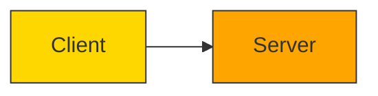

# 🖥️ **DBMS – Centralized & Client-Server Architecture**

> *“Architecture defines where the brain lives — in a single mainframe? Or distributed across clients and servers? Your choice shapes performance, scalability, and resilience.”*

Understanding DBMS architecture is crucial because it determines:
- ✅ Who processes data?
- ✅ Where is data stored?
- ✅ How users access it?
- ✅ What happens if one component fails?

Let’s explore the evolution — from **centralized mainframes** to **modern multi-tier systems**.


## 🏢 1. Centralized DBMS Architecture

> 💡 *The “mainframe era” — all power concentrated in one place.*

### 🧭 What is It?
- All processing, storage, and user interaction handled by a **single central computer** (mainframe/server).
- Users connect via **dumb terminals** — no local processing.
- Terminals = input/output devices only → send commands → server executes → returns results.

> 📷 *Think: 1980s bank teller using a green-screen terminal connected to a IBM mainframe.*


### ⚙️ How It Works

```
┌──────────────┐     ┌─────────────────────┐     ┌──────────────┐
│   Terminal   │ →→→ │   Central Mainframe │ ←←← │   Database   │
└──────────────┘     │   (DBMS + Logic)    │     └──────────────┘
                     └─────────────────────┘
```

> 🔁 Workflow:
> 1. User types query on terminal → sent to server  
> 2. Server processes query → accesses database  
> 3. Server returns result → displayed on terminal  

> 🎯 *Example*: University student portal — all grade checks, course registrations → processed on central mainframe → terminals across campus display results.


### ✅ Benefits of Centralized Architecture

| Benefit | Explanation |
|--------|-------------|
| 🛡️ **Centralized Control** | Single point of security, backup, updates → easier to manage |
| 🛠️ **Simplified Maintenance** | One system to patch, upgrade, monitor → less admin overhead |


### ❌ Drawbacks of Centralized Architecture

| Drawback | Explanation |
|---------|-------------|
| 🚫 **Single Point of Failure** | If mainframe crashes → entire system down → catastrophic |
| 🐢 **Scalability Issues** | As users grow → server becomes bottleneck → slow response times |
| 💸 **High Cost** | Mainframes are expensive to buy, maintain, cool, and power |

> ⚠️ *Used today mostly in legacy systems (e.g., banks, airlines) — but rarely for new projects.*


## 🖥️➡️🌐 2. Client-Server DBMS Architecture

> 🚀 *The modern standard — distribute work between clients (front-end) and servers (back-end).*

### 🧭 What is It?
- **Client**: Handles UI, user input, local logic (e.g., desktop app, web browser)
- **Server**: Manages data storage, complex queries, transactions, security
- Communication over network → clients send requests → server processes → returns results

> 💬 *Example*: Banking app → teller uses desktop client → connects to central DB server → checks balance → displays result.


### 🔄 Two-Tier Client-Server Architecture



#### 🧱 Structure:
- **Client Tier**: UI + Application Logic
- **Server Tier**: Database + Query Processing

> 🎯 *Example*: Retail POS system — cashier enters product code → client sends query → server returns price → client displays receipt.


### ✅ Benefits of Two-Tier

| Benefit | Explanation |
|--------|-------------|
| 🚀 **Direct Interaction** | Fast for simple tasks — no middle layer → low latency |
| 🛠️ **Simplicity** | Easy to implement for small-to-medium apps |


### ❌ Drawbacks of Two-Tier

| Drawback | Explanation |
|---------|-------------|
| 🐢 **Scalability Limits** | Server becomes bottleneck as clients increase → performance degrades |
| 🔄 **Maintenance Overhead** | Each client may need updates → hard to manage at scale |
| 🔐 **Security Risk** | Clients often have direct DB access → higher attack surface |

> ⚠️ *Good for internal tools; risky for public-facing apps.*


## 🧱 3. Three-Tier Client-Server Architecture

> 🌐 *The gold standard for enterprise, web, and cloud applications.*

### 🧭 What is It?
Adds an **Application Server (Middle Tier)** between client and database server.

```
┌──────────────┐     ┌─────────────────────┐     ┌──────────────┐
│   Client     │ ↔↔↔ │   Application Server│ ↔↔↔ │   Database   │
│ (Browser/App)│     │ (Business Logic)    │     │   Server     │
└──────────────┘     └─────────────────────┘     └──────────────┘
```

#### 🧩 Components:

| Layer | Role | Example |
|-------|------|---------|
| **Presentation Layer** | User interface (GUI, Web, Mobile) | React frontend, iOS app |
| **Application Layer** | Business logic, validation, APIs | Node.js server, Spring Boot API |
| **Data Layer** | Database + storage + transactions | PostgreSQL, MySQL, MongoDB |

> 🎯 *Example*: Online food delivery app —  
> - User browses menu (Client)  
> - App server validates order + calculates total (App Server)  
> - DB server stores order + updates inventory (Database Server)


### ✅ Advantages of Three-Tier

| Advantage | Explanation |
|----------|-------------|
| 🚀 **Better Load Management** | App server filters/optimizes requests → reduces DB load |
| 🔐 **Enhanced Security** | Clients never touch DB directly → app server acts as gatekeeper |
| 🧱 **Modularity** | Each tier can be developed, scaled, updated independently |
| 🌐 **Remote Access** | Clients anywhere → connect via internet → ideal for SaaS/cloud |

> 💼 *Used by Netflix, Amazon, Facebook, banking apps, ERP systems.*


### 🎯 Real-World Use Case: Healthcare System

```
┌──────────────┐     ┌─────────────────────┐     ┌──────────────┐
│   Patient    │ ↔↔↔ │   App Server        │ ↔↔↔ │   Patient    │
│   Portal     │     │ (Auth, Rules, Logs) │     │   Database   │
└──────────────┘     └─────────────────────┘     └──────────────┘
```

> 🔒 *Patient sees only their own records — app server enforces role-based access — DB stays secure.*


## 🧬 Beyond Three Tiers: n-Tier Architectures

> 🌐 *For complex enterprise systems — break down further for specialization.*

### 🧭 What is n-Tier?
- Adds more layers beyond 3 tiers — e.g., authentication layer, caching layer, analytics layer, microservices layer.
- Each layer handles a specific task → highly modular and scalable.

> 🏢 *Example*: Enterprise CRM system:
> - Tier 1: Web UI (React)
> - Tier 2: API Gateway
> - Tier 3: Authentication Service
> - Tier 4: Business Logic Service
> - Tier 5: Data Aggregation Service
> - Tier 6: Database Service


### ✅ Benefits of n-Tier

| Benefit | Explanation |
|--------|-------------|
| 🧩 **Modularity** | Teams can develop/test/maintain layers independently |
| 🛡️ **Resilience** | Failure in one layer doesn’t crash the whole system |
| 🚀 **Scalability** | Scale individual layers (e.g., add more app servers during peak traffic) |
| 🔄 **Flexibility** | Swap out layers without affecting others (e.g., replace DB from MySQL to PostgreSQL) |

> 🌩️ *Ideal for cloud-native, microservices-based, AI-driven systems.*


## 🆚 Comparison Table: Centralized vs Client-Server

| Feature | Centralized | Two-Tier | Three-Tier | n-Tier |
|--------|-------------|----------|------------|--------|
| **Processing** | All on mainframe | Client + Server | Client + App Server + DB Server | Multiple specialized layers |
| **Scalability** | Poor | Medium | Good | Excellent |
| **Security** | High (central control) | Medium | High (gatekeeper) | Very High (layered defense) |
| **Maintenance** | Easy (one system) | Hard (client updates) | Moderate | Complex (but modular) |
| **Use Case** | Legacy systems | Internal tools | Web/mobile apps | Enterprise/cloud systems |


## 🖼️ Visual Summary: Evolution of Architectures

```
┌─────────────────────────────────────────────────────────────────────┐
│  🏢 Centralized: All-in-One Mainframe                               │
│  [Terminals] → [Mainframe + DB]                                     │
└─────────────────────────────────────────────────────────────────────┘
          ↓
┌─────────────────────────────────────────────────────────────────────┐
│  🖥️➡️🌐 Two-Tier: Client + Server                                  │
│  [Client] ↔ [Server + DB]                                           │
└─────────────────────────────────────────────────────────────────────┘
          ↓
┌─────────────────────────────────────────────────────────────────────┐
│  🧱 Three-Tier: Client + App Server + DB Server                     │
│  [Client] ↔ [App Server] ↔ [DB Server]                              │
└─────────────────────────────────────────────────────────────────────┘
          ↓
┌─────────────────────────────────────────────────────────────────────┐
│  🧬 n-Tier: Modular Layers for Specialization                       │
│  [UI] → [API] → [Auth] → [Logic] → [Cache] → [DB] → [Analytics]     │
└─────────────────────────────────────────────────────────────────────┘
```


📌 **Quick Memory Hook:**

> 🏢 **Centralized** = One Brain → Simple but Fragile  
> 🖥️➡️🌐 **Two-Tier** = Client + Server → Fast but Scalable? Not Really  
> 🧱 **Three-Tier** = Client + App + DB → Secure, Scalable, Modern  
> 🧬 **n-Tier** = Many Brains → Enterprise-Ready, Cloud-Native

> *“Choose your architecture wisely — it’s the foundation of your system’s future.”* 🏗️✨
