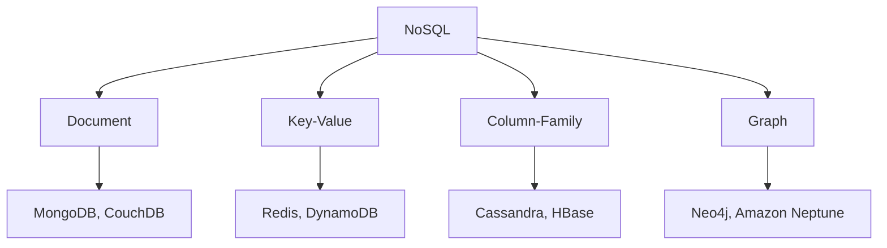

# 🏷️ **DBMS – Classification**

> *“Not all databases are created equal — choosing the right DBMS is like picking the right vehicle: a scooter won’t fly, and a jet won’t fit in your garage.”*

DBMSs are categorized based on **how they store data**, **who uses them**, **where they live**, **what they cost**, and **what they’re built for**. Let’s explore the full taxonomy — with examples, pros/cons, and real-world use cases.


## 🧩 1. Classification by **Data Model**

> *The backbone of any DBMS — defines structure, relationships, and query style.*

| Type | Structure | Key Features | Examples | Best For |
|------|-----------|--------------|----------|----------|
| **🔹 Relational (RDBMS)** | Tables (rows × columns) with keys | ACID compliance, SQL, normalization | MySQL, PostgreSQL, Oracle, SQL Server | Financial systems, ERP, e-commerce |
| **🔹 Object-Oriented (OODBMS)** | Objects + methods + inheritance | Native OOP support, no ORM needed | db4o, ObjectDB, Versant | CAD, multimedia, scientific apps |
| **🔹 Hierarchical** | Tree (parent → children) | Fast 1:N access, rigid structure | IBM IMS | Legacy banking, telecom systems |
| **🔹 Network** | Graph (many-to-many links) | Flexible relationships, pointer-based | IDMS, Raima | Complex enterprise workflows |
| **🔹 NoSQL** | Schema-flexible, distributed | High scalability, eventual consistency | MongoDB, Cassandra, Redis, Neo4j | Big data, real-time apps, IoT |


### 🌐 NoSQL Subtypes — The “Not Only SQL” Family



| Type | Structure | Strengths | Real-World Use |
|------|-----------|-----------|----------------|
| **📄 Document** | JSON/BSON documents (nested fields) | Flexible schema, developer-friendly | CMS, user profiles, catalogs |
| **🔑 Key-Value** | `{ID: "101", value: {...}}` | Blazing fast reads/writes, simple | Caching, sessions, counters |
| **📊 Column-Family** | Columns grouped by key (wide rows) | High write throughput, time-series | Analytics, IoT sensor data |
| **🕸️ Graph** | Nodes + edges (relationships first) | Traverses connections in milliseconds | Fraud detection, social networks, recommendation engines |

> 💡 **Rule of Thumb**:  
> - Use **Relational** → for *consistency & complex queries*  
> - Use **NoSQL** → for *scale, speed, or unstructured data*


## 👥 2. Classification by **User Support**

| Type | Users | Concurrency | Use Case | Example |
|------|-------|-------------|----------|---------|
| **🧍 Single-User** | 1 user at a time | None | Personal projects, small biz | Microsoft Access, SQLite |
| **👥 Multi-User** | Many users, concurrent access | ✅ Full (locking, MVCC) | Enterprise, web apps | PostgreSQL, Oracle, SQL Server |

> 📌 *SQLite is technically single-user but supports *read concurrency* — great for mobile apps!*


## 🌍 3. Classification by **Database Distribution**

| Type | Data Location | Pros | Cons | Example |
|------|---------------|------|------|---------|
| **🏢 Centralized** | One server/location | Simple, secure, easy to manage | Single point of failure, limited scalability | University DB, local ERP |
| **🌐 Distributed (DDBMS)** | Spread across locations (LAN/WAN) | High availability, local processing, fault tolerance | Complex design, network dependency | Amazon DynamoDB, Google Spanner |

### 🔁 DDBMS Subtypes:
| Type | Description | Example |
|------|-------------|---------|
| **Homogeneous** | All nodes use same DBMS (e.g., PostgreSQL everywhere) | Multi-region PostgreSQL cluster |
| **Heterogeneous** | Mixed DBMSs (e.g., MySQL + MongoDB + Oracle) — unified via middleware | Global bank with legacy + modern systems |

> 🌐 *Modern cloud DBs (e.g., **Azure Cosmos DB**, **Firestore**) are auto-distributed — you don’t manage shards.*


## 💰 4. Classification by **Cost & Licensing**

| Type | Cost | Customization | Support | Ideal For |
|------|------|---------------|---------|-----------|
| **🔓 Open-Source** | Free (community-driven) | Fully modifiable | Community forums / paid SLAs | Startups, SMEs, devs |
| **🛒 Commercial** | Licensing fees (per core/user) | Limited source access | 24/7 enterprise support | Banks, govt, Fortune 500 |

| DBMS | Type | Notes |
|------|------|-------|
| **MySQL**, **PostgreSQL**, **MariaDB** | Open-Source | PostgreSQL: ACID + JSON + extensions |
| **Oracle**, **SQL Server**, **IBM Db2** | Commercial | Oracle: Gold standard for mission-critical |
| **Cloud DBs (Aurora, Cosmos DB)** | Pay-as-you-go | Managed service — no ops overhead |

> 💡 *Many open-source DBs offer “Enterprise Editions”* (e.g., **MongoDB Enterprise**, **Redis Enterprise**) — open core + paid features.


## 🎯 5. Classification by **Purpose**

| Type | Focus | Features | Examples |
|------|-------|----------|----------|
| **🛠️ General-Purpose** | Versatile, broad use | SQL, ACID, reporting, replication | SQL Server, PostgreSQL, MySQL |
| **🎯 Special-Purpose** | Optimized for niche tasks | High-speed ingest, streaming, spatial, temporal | TimescaleDB (time-series), Redis (caching), Neo4j (graphs), Elasticsearch (search) |

### 🔍 Special-Purpose Examples:
| DBMS | Specialization | Use Case |
|------|----------------|----------|
| **Apache Kafka (KSQL)** | Streaming data | Real-time fraud detection |
| **TimescaleDB** | Time-series data | IoT sensor monitoring |
| **PostGIS (PostgreSQL extension)** | Geospatial data | Maps, route planning |
| **FaunaDB / Firebase Firestore** | Serverless, real-time sync | Mobile/web apps with live updates |

> 🧠 *Hybrid systems are rising:*  
> e.g., **PostgreSQL** = relational core + JSONB (NoSQL) + PostGIS (geo) + TimescaleDB (time-series) → **“One DB to rule them all?”**


## 🆚 Quick Comparison Table

| Criteria | Best Choice |
|---------|-------------|
| **ACID + Complex Queries** | ✅ PostgreSQL / Oracle |
| **Massive Scale + Flexibility** | ✅ MongoDB / Cassandra |
| **Real-Time Relationships** | ✅ Neo4j |
| **Lightweight / Embedded** | ✅ SQLite |
| **Cloud-Native, Serverless** | ✅ DynamoDB / Firestore / Supabase |
| **Budget-Conscious & Powerful** | ✅ PostgreSQL (open-source king) |


## 🖼️ Visual Summary: DBMS Classification Tree

```
┌───────────────────────────────────────────────────────────────────────┐
│                             DBMS Classification                        │
└───────────────────────────────────────────────────────────────────────┘
           ↓
┌─────────────────────┐     ┌─────────────────────┐     ┌─────────────────────┐
│ 🧩 By Data Model    │     │ 👥 By User Support   │     │ 🌍 By Distribution   │
│ - Relational        │     │ - Single-User        │     │ - Centralized        │
│ - NoSQL (4 types)   │     │ - Multi-User         │     │ - Distributed        │
│ - OO / Hier / Net   │     └─────────────────────┘     └─────────────────────┘
└─────────────────────┘               ↓                           ↓
┌─────────────────────┐     ┌─────────────────────┐     ┌─────────────────────┐
│ 💰 By Cost          │     │ 🎯 By Purpose        │     │ 🌐 Cloud vs On-Prem  │
│ - Open-Source       │     │ - General-Purpose    │     │ - Managed Services   │
│ - Commercial        │     │ - Special-Purpose    │     │ - Self-Hosted        │
└─────────────────────┘     └─────────────────────┘     └─────────────────────┘
```


## 🎯 Real-World Decision Flow

> *Need help choosing? Ask:*

1. 🔐 **Do I need strict consistency?** → **RDBMS**  
2. 📈 **Is scale (1M+ users) the priority?** → **NoSQL**  
3. 🌐 **Is data global/distributed?** → **DDBMS (DynamoDB, Spanner)**  
4. 💸 **Zero budget?** → **PostgreSQL / MySQL**  
5. 📊 **Real-time analytics?** → **ClickHouse / Druid**  
6. 🧠 **AI/ML features?** → **SingleStore / Pinecone (vector DB)**


📌 **Quick Memory Hook:**

> 🧩 **Data Model** = *What’s inside?*  
> 👥 **User Support** = *Who’s using it?*  
> 🌍 **Distribution** = *Where’s it stored?*  
> 💰 **Cost** = *What’s it worth?*  
> 🎯 **Purpose** = *What’s it built for?*

> *“Classify first — build second. The right DBMS makes everything easier.”* 🛠️✨

