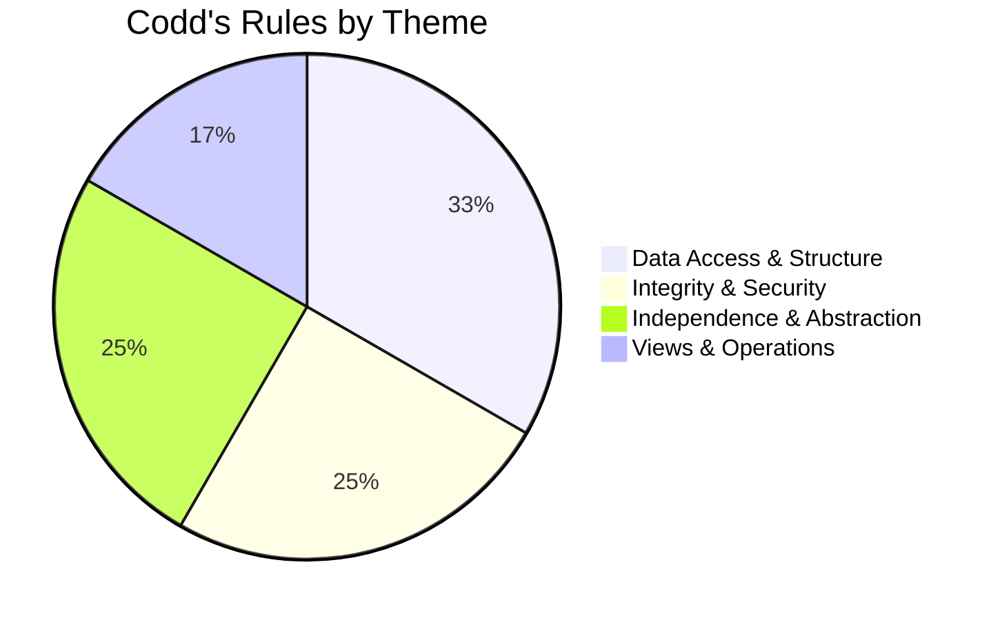

# 📜 **DBMS – Codd’s 12 Rules**  
### *The Golden Commandments of Relational Databases*

> 💡 **Dr. Edgar F. Codd** (1970) — the father of the relational model — defined **12 rules** that a system must satisfy to be called a *true* **Relational Database Management System (RDBMS)**.

> ❗ *Fun Fact*:  
> **No commercial RDBMS fully complies with all 12 rules** — even SQL-based systems like Oracle or PostgreSQL violate some (especially Rule 3 and Rule 6). But these rules remain the **gold standard** for relational integrity, abstraction, and design.

Let’s explore each rule — clearly, memorably, and practically.

## 🏛️ **Foundation Rule (The Zeroth Rule)**  
> 🧱 *"A relational DBMS must manage its stored data *exclusively* using its relational capabilities."*  
→ No bypassing tables via pointers, file offsets, or procedural APIs.  
→ If a system uses non-relational methods (e.g., direct file access), it’s **not relational** — even if it has SQL.

> ✅ Applies to: MySQL, PostgreSQL *(mostly)*  
> ❌ Violated by: Early SQL Server (pre-2000), legacy systems using BLOB pointers.

## 🔢 **The 12 Rules — Explained**

| # | Rule Name | What It Means | Why It Matters | Real-World Example |
|---|-----------|---------------|----------------|--------------------|
| **1** | 📋 **Information Rule** | All data — user data *and* metadata — must be stored *as values in tables*. → No hidden files, no side storage. | Ensures uniformity: *everything* is queryable via SQL. | ❌ Violation: Storing BLOBs externally with path strings in DB. |
| **2** | 🔑 **Guaranteed Access Rule** | Every atomic data value must be accessible via **{table, primary key, column}** — *nothing else*. → No pointers, addresses, or offsets. | Guarantees logical (not physical) data access. | ✅ `SELECT salary FROM Employees WHERE emp_id = 101;` |
| **3** | ❓ **Systematic Treatment of NULLs** | `NULL` must be handled consistently as *missing/unknown/inapplicable* — not as zero or blank. → Supports 3-valued logic (TRUE, FALSE, UNKNOWN). | Prevents misinterpretation (e.g., `NULL ≠ 0`). ⚠️ *Most DBMSs fail here.* | ❌ In MySQL: `NULL = NULL` → `UNKNOWN`, not `TRUE`. |
| **4** | 📘 **Active Online Catalog** | Schema (tables, keys, constraints) must be stored in *system tables* (e.g., `INFORMATION_SCHEMA`). → Queryable *using the same language* (SQL). | Enables self-describing databases (introspection). | ✅ `SELECT * FROM INFORMATION_SCHEMA.TABLES;` |
| **5** | 🗣️ **Comprehensive Data Sub-Language** | Must support *one* language (e.g., SQL) for: • DDL (CREATE, ALTER) • DML (SELECT, INSERT) • DCL (GRANT, REVOKE) • Transaction control (COMMIT, ROLLBACK) | Unifies interface — no backdoors. | ❌ Violation: Using CLI tools *outside* SQL to modify schema. |
| **6** | 🖼️ **View Updating Rule** | All *theoretically updatable* views must be *practically updatable* by the system. → e.g., `UPDATE View SET ...` should work if view is based on a single table. | Ensures views aren’t just read-only shadows. | ❌ Most DBMSs restrict view updates (e.g., joins, aggregates). |
| **7** | 🧩 **High-Level Insert/Update/Delete** | Must support **set-level operations** — not just row-by-row. → e.g., `INSERT INTO ... SELECT ...` → Supports `UNION`, `INTERSECT`, `EXCEPT` in DML. | Enables bulk data manipulation efficiently. | ✅ `DELETE FROM Orders WHERE cust_id IN (SELECT id FROM InactiveCustomers);` |
| **8** | 💾 **Physical Data Independence** | Apps must *not break* if storage changes (e.g., HDD → SSD, heap → B+Tree). | Enables hardware upgrades without app changes. | ✅ Index added? Queries still work. |
| **9** | 🧠 **Logical Data Independence** | Apps must *not break* if logical schema changes (e.g., splitting `Employees` into `Employees + Departments`). → Achieved via **views** and **abstraction**. | *Hardest rule* — most systems fail here. | ⚠️ Rarely fully supported. Requires perfect view layering. |
| **10** | 🛡️ **Integrity Independence** | Constraints (PK, FK, CHECK) must be definable *in the DB*, not in apps. → Modifiable *without* changing code. | Ensures data integrity at the source. | ✅ `ALTER TABLE Orders ADD CONSTRAINT fk_cust FOREIGN KEY (cust_id) REFERENCES Customers(id);` |
| **11** | 🌐 **Distribution Independence** | Users must *not know* data is distributed (e.g., sharded across servers). → “Location transparency.” | Foundation of **Distributed RDBMS** (e.g., Google Spanner). | ✅ Cloud DBs hide replication/sharding from app layer. |
| **12** | 🚫 **Non-Subversion Rule** | Low-level interfaces (e.g., APIs, CLI) must *not bypass* security/integrity rules. → No backdoors! | Prevents privilege escalation via system tools. | ❌ Old systems allowed direct file edits → corrupt DB. |

## 🎯 Visual Summary: Codd’s Rules by Category

- **🟦 Structure & Access** (Rules 1, 2, 4, 5)  
- **🟩 Integrity & Security** (Rules 3, 10, 12)  
- **🟨 Independence** (Rules 8, 9, 11)  
- **🟪 Views & Set Ops** (Rules 6, 7)

## 🆚 Reality Check: Do Modern DBMSs Comply?

| DBMS | Compliant? | Notes |
|------|------------|-------|
| **Oracle** | ~9/12 | Strong on rules 1–5, 8, 10, 11, 12. Weak on 3 (NULLs), 6 (view updates), 9 (logical independence) |
| **PostgreSQL** | ~10/12 | Best open-source compliance. Still struggles with Rule 9. |
| **MySQL** | ~8/12 | Violates Rule 3 (NULL handling), Rule 6 (limited view updates), Rule 9 |
| **SQL Server** | ~9/12 | Solid, but legacy features break Rule 12 (e.g., `xp_cmdshell`) |
| **SQLite** | ~7/12 | Lacks user management (Rule 10), view updates (Rule 6), distribution (Rule 11) |

> 🔍 *No system is 100% compliant — but the closer, the more “relational” it is.*

## 💡 Why Codd’s Rules Still Matter Today

✅ **Design Guidance**: Even NoSQL systems borrow concepts (e.g., logical independence → schema evolution in MongoDB).  
✅ **Evaluation Tool**: Helps compare DBMS capabilities objectively.  
✅ **Educational Foundation**: Teaches *why* relational databases are robust, secure, and scalable.

> 🧭 *Remember*:  
> Codd’s goal wasn’t perfection — it was **principled data management**.

## 🧠 Pro Tip: Mnemonic for Codd’s Rules  
Use: **"I Guarantee Serious Action Concerning Views, High-Level Processing, Physical & Logical Integrity, Distribution, and No Subversion"**  
→ First letters: **I G S A C V H P L I D N S**

Or just remember:  
> **"1-2-3: Store, Access, NULLs  
> 4-5: Catalog & Language  
> 6-7: Views & Sets  
> 8-9: Physical & Logical Independence  
> 10-12: Integrity, Distribution, Security"**

📌 **Quick Recap**:

> 📜 **Codd’s Rules = The Constitution of Relational Databases**  
> They define what makes a DBMS *truly relational* — not just SQL-flavored.

> *“A system that ignores Codd’s principles may store data — but it doesn’t *manage* it.”* — Inspired by E.F. Codd
