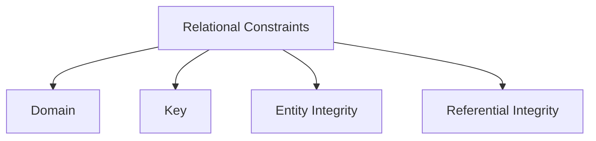

# ⚖️ **DBMS – Relational Model Constraints**  
### *The Guardians of Data Integrity*

> 🔐 *Constraints are the rules that prevent bad data from polluting your database.*  
> Without them, a “student” could be 200 years old, an order could ship to a non-existent customer, or accounts could vanish into the void.

Let’s explore the **four pillars of relational integrity** — from schema rules to real-world safeguards.


## 🧭 Constraint Taxonomy: Where Do Rules Live?

| Type | Defined In | Enforced By | Example |
|------|------------|-------------|---------|
| **✅ Inherent Constraints** | Relational model itself | DBMS (automatically) | No duplicate tuples, unordered rows |
| **✅ Schema-Based Constraints** | `CREATE TABLE` DDL | DBMS (at insert/update) | `PRIMARY KEY`, `FOREIGN KEY`, `CHECK` |
| **⚠️ Application-Based Constraints** | Business logic / code | Developers (via app/triggers) | *“Salary < manager’s salary”* |

> 💡 *Goal*: Push as many rules into **schema-based** — so the DBMS enforces them *reliably*, universally, and efficiently.


## 🧱 The 4 Core Relational Constraints




### 1️⃣ **🎯 Domain Constraints**  
> *“Only valid data allowed — no nonsense!”*

Ensures every attribute’s value lies within its **predefined domain** (type + range).

#### ✅ Enforced via:
- Data types (`INT`, `VARCHAR`, `DATE`)
- `CHECK` constraints
- `ENUM`, `DOMAIN` (PostgreSQL)

#### 📋 Example:
```sql
CREATE TABLE Employee (
    Age INT CHECK (Age BETWEEN 18 AND 65),
    Email VARCHAR(100) CHECK (Email LIKE '%@%.%'),
    Dept VARCHAR(20) DEFAULT 'HR' CHECK (Dept IN ('HR', 'IT', 'Finance'))
);
```

#### ❌ Violations:
| Operation | Result |
|---------|--------|
| `INSERT INTO Employee(Age) VALUES (-5);` | ❌ Rejected |
| `UPDATE Employee SET Email = 'invalid';` | ❌ Rejected |

> 🎯 *Domain constraints = First line of defense against garbage-in, garbage-out.*


### 2️⃣ **🔑 Key Constraints**  
> *“Every record must have a unique identity.”*

Guarantees **uniqueness** via keys:

| Key Type | Definition | Example |
|---------|------------|---------|
| **Superkey** | Any attribute set that uniquely identifies tuples | `{SSN}`, `{Email, DOB}` |
| **Candidate Key** | *Minimal* superkey (no redundant attributes) | `{SSN}`, `{PassportNo}` |
| **Primary Key (PK)** | One chosen candidate key — **NOT NULL + Unique** | `PRIMARY KEY (SSN)` |

#### 📋 Real Table: `STUDENT`

| Name | SSN (PK) | Home Phone | Office Phone | Age | GPA |
|------|----------|------------|--------------|-----|-----|
| Ali | `422-11-2320` | NULL | `(817)749-1253` | 25 | 3.53 |
| Sara | `533-69-1238` | `(817)839-8461` | NULL | 19 | 3.25 |

✅ **Why SSN?**  
- Unique per student  
- Never changes  
- Not NULL (legally required in many systems)

> ⚠️ *No PK = Chaos*: Duplicates → ambiguity → broken reports.


### 3️⃣ **🛡️ Entity Integrity Constraint**  
> *“Primary keys must be sacred — no NULLs, no duplicates.”*

#### 🔒 Two Rules:
1. **PK ≠ NULL**  
2. **PK values must be unique**

#### 📋 Example:
```sql
CREATE TABLE Customer (
    CustID INT PRIMARY KEY,  -- ← NOT NULL + Unique enforced automatically
    Name VARCHAR(50)
);
```

#### ❌ Violation:
```sql
INSERT INTO Customer VALUES (NULL, 'John');  -- ❌ Rejected!
INSERT INTO Customer VALUES (100, 'Ali');
INSERT INTO Customer VALUES (100, 'Sara');   -- ❌ Duplicate PK!
```

> 💡 *Why?*  
> NULL PK = unidentifiable record → can’t be referenced → breaks referential integrity.


### 4️⃣ **🔗 Referential Integrity Constraint**  
> *“Every child must have a parent — or be parentless (NULL).”*

Ensures **foreign keys (FK)** reference **existing primary keys**.

#### 🔄 Structure:
```sql
CREATE TABLE Employee (
    EmpID INT PRIMARY KEY,
    Name VARCHAR(50),
    DeptID INT,
    FOREIGN KEY (DeptID) REFERENCES Department(DeptID)
);
```

#### 📋 Tables in Action:

**`Department`**  
| DeptID (PK) | DeptName |
|-------------|----------|
| 1 | HR |
| 4 | Admin |
| 5 | Research |

**`Employee`**  
| EmpID | Name | DeptID (FK) |
|-------|------|-------------|
| 101 | Ali | 5 ✅ |
| 102 | Sara | 4 ✅ |
| 103 | Ben | 99 ❌ **Rejected!** |


#### 🛠️ Handling FK Violations on **DELETE**

What if we try to delete `DeptID = 5` (Research) while employees still belong to it?

| Strategy | Behavior | Use Case |
|---------|----------|----------|
| **RESTRICT** (default) | ❌ Block deletion | Critical data (e.g., active departments) |
| **CASCADE** | ✅ Delete all referencing employees | Temporary cleanup |
| **SET NULL** | ✅ Set `DeptID = NULL` for affected employees | Soft-deletion workflows |
| **SET DEFAULT** | ✅ Set `DeptID = 1` (e.g., “Unassigned”) | Reassign to default dept |

```sql
FOREIGN KEY (DeptID) 
  REFERENCES Department(DeptID)
  ON DELETE SET NULL
```

> 💡 *Best practice*: Prefer `RESTRICT` for production; use `CASCADE` only when *intentional* data destruction is needed.


## 🚨 Handling Constraint Violations: What Happens When Rules Break?

| Operation | Possible Violations | DBMS Response |
|----------|---------------------|---------------|
| **INSERT** | • Domain (e.g., `Age = 'abc'`) <br> • PK duplicate <br> • NULL PK <br> • Invalid FK | ❌ **Reject entire transaction** (ACID) |
| **UPDATE** | • PK → duplicate or NULL <br> • FK → non-existent value <br> • Domain violation | ❌ Roll back change |
| **DELETE** | • FK dependency (if `ON DELETE RESTRICT`) | ❌ Block deletion |

> ⚠️ *Atomicity in action*: If *any* constraint fails — the whole transaction aborts.


## 🧩 Beyond Schema: Application-Level Constraints  
*(The Rules SQL Can’t Express)*

Some business rules are too complex for `CHECK` or FKs — they live in **application logic** or **triggers**.

| Rule | Why Not in Schema? | How to Enforce |
|------|---------------------|----------------|
| *“Employee salary < manager’s salary”* | Requires comparing across rows | ✅ **Trigger** or App validation |
| *“Total weekly hours ≤ 56”* | Aggregation + time window | ✅ **Stored Procedure** + App check |
| *“Discount ≥ 0 and ≤ list_price”* | Cross-column logic | ✅ `CHECK (Discount BETWEEN 0 AND ListPrice)` *(possible!)* |

#### 📋 Example: Salary Hierarchy via Trigger (PostgreSQL)
```sql
CREATE OR REPLACE FUNCTION check_salary()
RETURNS TRIGGER AS $$
BEGIN
  IF NEW.Salary >= (SELECT Salary FROM Employee WHERE EmpID = NEW.ManagerID) THEN
    RAISE EXCEPTION 'Employee salary cannot exceed manager’s salary';
  END IF;
  RETURN NEW;
END;
$$ LANGUAGE plpgsql;

CREATE TRIGGER salary_check 
BEFORE INSERT OR UPDATE ON Employee
FOR EACH ROW EXECUTE FUNCTION check_salary();
```

> ✅ *Use triggers sparingly* — they’re powerful but hard to debug. Prefer app-level checks when possible.


## 🖼️ Visual Summary: Constraint Hierarchy

```
┌───────────────────────────────────────────────────────┐
│               Relational Integrity                    │
└───────────────────────────────────────────────────────┘
           ↓
┌────────────────────────────┐     ┌────────────────────────────┐
│    Structural Integrity    │     │      Referential Integrity │
├────────────────────────────┤     ├────────────────────────────┤
│ • No duplicate tuples      │     │ • Foreign key → PK match   │
│ • PK ≠ NULL, unique        │     │ • ON DELETE/UPDATE rules   │
│ • Domain: type + range     │     │ • No orphans               │
└────────────────────────────┘     └────────────────────────────┘
           ↓
┌───────────────────────────────────────────────────────┐
│           Business Rules (Application-Level)           │
│ • Cross-row logic (salary < manager)                   │
│ • Temporal rules (max 56 hrs/week)                     │
└───────────────────────────────────────────────────────┘
```


## 🧪 Quick Self-Check (Spot the Violation!)

| Scenario | Constraint Violated? | Fix |
|---------|----------------------|-----|
| Insert `Student(SSN=NULL, Name='Ali')` | ✅ Entity Integrity | Provide valid SSN |
| Update `DeptID=99` for an employee | ✅ Referential Integrity | Use existing DeptID or `SET NULL` |
| Insert `Age=150` (domain: 18–65) | ✅ Domain | Validate input |
| Two employees with same `EmpID` | ✅ Key Constraint | Enforce PK |


📌 **Quick Memory Hook:**

> 🎯 **Domain** = Valid values  
> 🔑 **Key** = Unique ID  
> 🛡️ **Entity Integrity** = PK ≠ NULL  
> 🔗 **Referential Integrity** = FK → PK (or NULL)  

> *“Constraints don’t limit freedom — they protect truth.”* ✅✨
