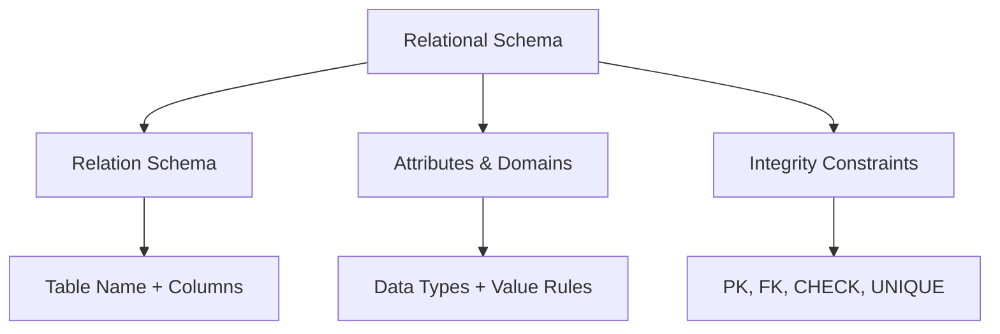

# 📐 **DBMS – Relational Database Schemas**  
### *The Blueprint of Your Data Universe*

> 🗺️ *A schema is not just a table list — it’s a **contract** between your data and the real world.*  
> It defines **what** you store, **how** it’s structured, and **why** it stays trustworthy.

Let’s build a deep, practical understanding — using the classic **COMPANY database** as our guide.


## 🧱 What Is a Relational Database Schema?

> ✅ **Definition**:  
> A **relational database schema** is a *static*, logical description of:
> - All **relations** (tables)
> - Their **attributes** (columns) and **domains** (value rules)
> - **Integrity constraints** (keys, relationships, checks)

> 📌 *Think of it like architectural plans for a building — before a single brick is laid.*

### 📦 Formal Structure
A database schema **S** consists of:
- A set of **relation schemas**: `R₁, R₂, ..., Rₙ`
- A set of **integrity constraints**: PK, FK, CHECK, etc.

Each **relation schema** is written as:  
`R(A₁: D₁, A₂: D₂, ..., Aₙ: Dₙ)`  
→ e.g., `EMPLOYEE(Ssn: CHAR(11), Name: VARCHAR(50), Salary: DECIMAL, Dno: INT)`

> ⚠️ **Schema ≠ Data**  
> - Schema = *Structure* (unchanging)  
> - Database State = *Current data* (always changing)


## 🧩 Core Components of a Schema



### 1️⃣ **Relation Schema (R)**  
Defines one table’s blueprint.

| Table | Schema |
|-------|--------|
| `EMPLOYEE` | `EMPLOYEE(Ssn, Fname, Lname, Salary, Dno)` |
| `DEPARTMENT` | `DEPARTMENT(Dnumber, Dname, Mgr_ssn, Mgr_start_date)` |
| `PROJECT` | `PROJECT(Pnumber, Pname, Plocation, Dnum)` |
| `WORKS_ON` | `WORKS_ON(Essn, Pno, Hours)` |

> 🔍 Note: This is *logical* — physical storage (indexes, files) is hidden.


### 2️⃣ **Attributes & Domains**  
Each column has a **domain** — the set of legal values.

| Attribute | Domain | Constraint |
|---------|--------|------------|
| `Ssn` | `CHAR(11)` matching `###-##-####` | `CHECK (Ssn ~ '^\d{3}-\d{2}-\d{4}$')` |
| `Salary` | `DECIMAL(10,2) ≥ 0` | `CHECK (Salary >= 0)` |
| `Dno` | `INT ∈ {1,4,5}` | `FOREIGN KEY → DEPARTMENT(Dnumber)` |
| `Hours` | `DECIMAL(5,1) ≥ 0 AND ≤ 168` | Max hours/week |

> 💡 *Domains prevent “garbage in” — e.g., `Salary = -1000` is impossible.*


### 3️⃣ **Database State (Instance)**  
The *actual data* at a point in time — must satisfy all constraints.

#### 📋 Example: `EMPLOYEE` Instance

| Fname | Lname | Ssn | Salary | Dno |
|-------|-------|-----|--------|-----|
| John | Smith | 123-45-6789 | 30,000 | 5 |
| Franklin | Wong | 333-44-5555 | 40,000 | 5 |
| Alicia | Zelaya | 999-88-7777 | 25,000 | 4 |

→ Each row is a **tuple** — e.g., `⟨John, Smith, 123-45-6789, 30000, 5⟩`

> ✅ *Valid state*: All tuples comply with domains & constraints.


## 🔑 Keys & Uniqueness: Finding Identity

### 🔑 Superkey vs Candidate Key vs Primary Key

| Type | Definition | Example (CAR table) |
|------|------------|---------------------|
| **Superkey** | Any set of attributes that uniquely identifies a tuple | `{License_number}`, `{License_number, VIN}`, `{VIN, Make, Model}` |
| **Candidate Key** | *Minimal* superkey (no redundant attributes) | `{License_number}`, `{VIN}` |
| **Primary Key (PK)** | One chosen candidate key — **NOT NULL + Unique** | `PRIMARY KEY (License_number)` |

#### 📋 COMPANY Examples:
- `EMPLOYEE`: PK = `Ssn`  
- `DEPARTMENT`: PK = `Dnumber`  
- `PROJECT`: PK = `Pnumber`  
- `WORKS_ON`: PK = `(Essn, Pno)` *(composite key)*

> ✅ *Why composite PK in WORKS_ON?*  
> One employee can work on many projects; one project can have many employees → M:N needs junction table with **combined PK**.


## 🔗 Relationships & Foreign Keys: The Web of Truth

Foreign keys (FKs) **enforce connections** between tables.

### 🌐 COMPANY Schema Diagram (Simplified)

```
┌─────────────┐       ┌──────────────┐       ┌────────────┐
│  EMPLOYEE   │       │  DEPARTMENT  │       │  PROJECT   │
├─────────────┤       ├──────────────┤       ├────────────┤
│ PK: Ssn     │ ◄───┐ │ PK: Dnumber  │ ◄───┐ │ PK: Pnumber│
│ Dno (FK) ───┼─────┘ │ Mgr_ssn (FK) │     └─│ Dnum (FK) ─┼───┐
└─────────────┘       └──────────────┘       └────────────┘   │
                             ▲                                │
                             └───────────┐                    │
                                         ▼                    ▼
                            ┌───────────────────────────────────────┐
                            │             WORKS_ON                  │
                            ├───────────────────────────────────────┤
                            │ PK: (Essn, Pno)                       │
                            │ Essn (FK) → EMPLOYEE(Ssn)             │
                            │ Pno  (FK) → PROJECT(Pnumber)          │
                            └───────────────────────────────────────┘
```

### 🔍 Critical FKs in COMPANY:
| Table | FK Attribute | References | Purpose |
|-------|--------------|------------|---------|
| `EMPLOYEE` | `Dno` | `DEPARTMENT(Dnumber)` | Which dept does employee belong to? |
| `DEPARTMENT` | `Mgr_ssn` | `EMPLOYEE(Ssn)` | Who manages this dept? |
| `PROJECT` | `Dnum` | `DEPARTMENT(Dnumber)` | Which dept owns this project? |
| `WORKS_ON` | `Essn` | `EMPLOYEE(Ssn)` | Which employee works here? |
| `WORKS_ON` | `Pno` | `PROJECT(Pnumber)` | Which project is it? |

> 💡 *Cyclic dependency?*  
> `EMPLOYEE → DEPARTMENT → EMPLOYEE` (via `Mgr_ssn`) is valid — but requires careful insertion order (e.g., insert employee first, then assign as manager).


## ⚖️ Integrity Constraints in Action

Let’s see how constraints protect COMPANY data.

### ✅ Valid Operations:
```sql
-- 1. Insert dept (no deps yet)
INSERT INTO DEPARTMENT VALUES (5, 'Research', NULL, '2025-01-01');

-- 2. Insert employee → assign to existing dept
INSERT INTO EMPLOYEE VALUES ('123-45-6789', 'John', 30000, 5);

-- 3. Assign manager (now that employee exists)
UPDATE DEPARTMENT SET Mgr_ssn = '123-45-6789' WHERE Dnumber = 5;
```

### ❌ Violations & How DBMS Responds:

| Operation | Violation | DBMS Response |
|---------|-----------|---------------|
| `INSERT INTO EMPLOYEE(Ssn, Dno) VALUES ('999-88-7777', 99);` | Referential Integrity (Dno=99 not in DEPARTMENT) | ❌ **Reject** |
| `INSERT INTO DEPARTMENT(Dnumber, Mgr_ssn) VALUES (1, '000-00-0000');` | Referential Integrity (Mgr_ssn not in EMPLOYEE) | ❌ **Reject** |
| `UPDATE EMPLOYEE SET Ssn = NULL WHERE Ssn = '123-45-6789';` | Entity Integrity (PK can’t be NULL) | ❌ **Reject** |
| `INSERT INTO WORKS_ON VALUES ('123-45-6789', 99, 10);` | FK violation (Pno=99 not in PROJECT) | ❌ **Reject** |


## 🛠️ Handling Real-World Complexity

### 🔄 **Cascading Deletes** (Example: Delete a Department)
What if we delete `Dnumber = 5` (Research)?

| Strategy | Effect on EMPLOYEE & PROJECT | When to Use |
|---------|------------------------------|-------------|
| `ON DELETE RESTRICT` | ❌ Block deletion (employees/projects exist) | Default — safety first |
| `ON DELETE CASCADE` | ✅ Delete all employees in dept + their WORKS_ON + dept’s projects | Cleanup test data |
| `ON DELETE SET NULL` | ✅ Set `Dno = NULL` for employees; `Dnum = NULL` for projects | “Orphan” records allowed |

```sql
-- Safer design: Prevent dept deletion if active employees exist
ALTER TABLE Employee 
ADD CONSTRAINT fk_dept 
FOREIGN KEY (Dno) REFERENCES Department(Dnumber)
ON DELETE RESTRICT;
```


## 🧠 Design Best Practices

| Principle | Why It Matters | COMPANY Example |
|---------|----------------|-----------------|
| **✅ Choose stable PKs** | Avoid changing PKs (triggers cascading updates) | `Ssn` > `Name` (names change) |
| **✅ Use surrogate keys when needed** | Natural keys may not exist (e.g., `PROJECT`) | Add `ProjID INT AUTO_INCREMENT` if `Pnumber` isn’t stable |
| **✅ Name FKs clearly** | `DeptID` > `Dno` (self-documenting) | `Employee.DepartmentID → Department.ID` |
| **✅ Enforce domains early** | Catch errors at entry, not in reports | `CHECK (Salary > 0)` |

> 💡 *Surrogate Key Tip*:  
> Use `INT AUTO_INCREMENT` or `UUID` when natural keys are long, changeable, or multi-column.


## 🖼️ Visual Summary: Schema Layers

```
┌───────────────────────────────────────────────────────┐
│                  Logical Schema (S)                   │
│  - Tables: EMPLOYEE, DEPARTMENT, PROJECT, WORKS_ON    │
│  - Attributes: Ssn, Dnumber, Pnumber, Essn, Pno       │
│  - Domains: CHAR(11), INT, DECIMAL                    │
│  - Constraints: PK, FK, CHECK                          │
└───────────────────────────────┬───────────────────────┘
                                ↓
┌───────────────────────────────────────────────────────┐
│                Database State (Instance)              │
│  - Current tuples: 8 employees, 3 depts, 6 projects   │
│  - All data satisfies schema constraints              │
└───────────────────────────────────────────────────────┘
```


## 🧪 Quick Self-Check

| Question | Answer |
|---------|--------|
| Can `WORKS_ON` have duplicate `(Essn, Pno)`? | ❌ No — it’s the PK |
| Can `Dno` in `EMPLOYEE` be NULL? | ✅ Yes — if employee isn’t assigned yet *(but schema may forbid it)* |
| Is `Mgr_ssn` in `DEPARTMENT` a PK? | ❌ No — it’s an FK; `Dnumber` is PK |
| What constraint ensures `Salary ≥ 0`? | ✅ Domain constraint (`CHECK`) |


📌 **Quick Memory Hook:**

> 📐 **Schema** = Blueprint  
> 🧍 **Tuple** = One row of truth  
> 🔑 **PK** = Identity card  
> 🔗 **FK** = Relationship glue  
> ⚖️ **Constraints** = Data police

> *“A well-designed schema doesn’t just store data — it tells a coherent story about your world.”* 🌍✨

