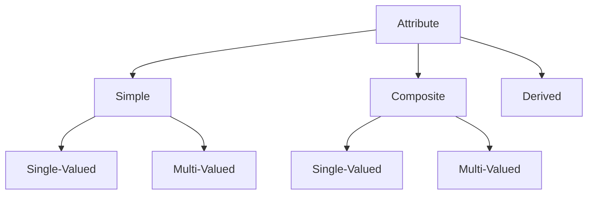
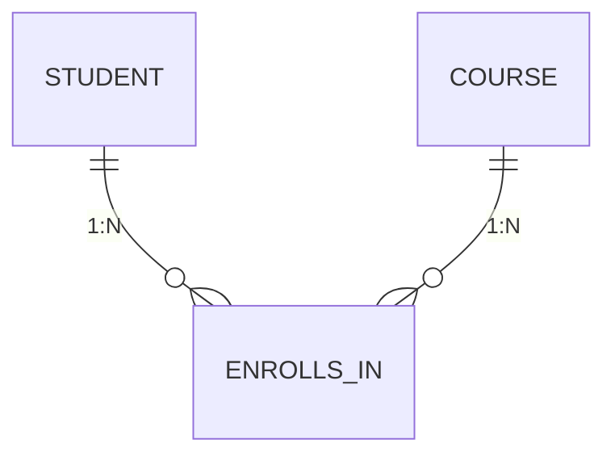

# 🐘 **DBMS – ER Model: Basic Concepts**  
### *Modeling the Real World, One Entity at a Time*

> 🌍 *The Entity-Relationship (ER) Model is the **conceptual blueprint** of a database — where real-world objects, their properties, and connections become structured design.*

It’s the **first step** in database design: *What exists? How do things relate?*  
Let’s break it down — from entities to cardinalities.

---
## 🧍 **1. Entity: The Building Block**

> ✅ **Definition**:  
> An **entity** is a distinguishable real-world object — *animate or inanimate* — that has **independent existence** and **attributes**.

### 📋 Examples:
| Domain | Entities |
|--------|----------|
| 🏫 School | `Student`, `Teacher`, `Class`, `Course` |
| 🏥 Hospital | `Patient`, `Doctor`, `Ward`, `Appointment` |
| 🛒 E-commerce | `Customer`, `Product`, `Order`, `Payment` |

> 🔍 *Key idea*: If you can assign **attributes** to it, it’s likely an entity.

---
### 🧩 **Entity Set**
A collection of entities of the **same type**.

| Entity Set | Contains |
|------------|----------|
| `Students` | All students in the school (e.g., Ali, Sara, Ben) |
| `Teachers` | All teachers (e.g., Dr. Lee, Prof. Gupta) |

> ⚠️ **Note**: Entity sets need *not* be disjoint — e.g., a `Person` can be in both `Students` and `Teachers`.

---
## 🏷️ **2. Attributes: The Identity Markers**

Attributes describe **properties** of an entity.

> ✅ Every attribute has a **domain** — the set of valid values.

| Attribute | Domain | Invalid Values |
|----------|--------|----------------|
| `Name` | Alphabetic string | `"123"`, `NULL` (if required) |
| `Age` | Integer, 0–150 | `-5`, `200` |
| `Email` | Format: `*@*.*` | `"invalid-email"` |

---

### 🔍 Types of Attributes



| Type | Definition | Example |
|------|------------|---------|
| **🔸 Simple** | Atomic (indivisible) | `Phone: "555-1234"` |
| **🔸 Composite** | Made of sub-attributes | `Name = {FirstName, LastName}` |
| **🔸 Derived** | Computed from other attributes | `Age = CURRENT_YEAR - DOB`<br>`AvgSalary = SUM(Salary)/COUNT(Dept)` |
| **🔸 Single-Valued** | One value per entity | `SSN`, `EmployeeID` |
| **🔸 Multi-Valued** | Zero/more values | `Phone = {"555-1234", "555-5678"}`<br>`Email = {"a@example.com", "a.work@org.com"}` |

#### 💡 Combinations in Practice:
| Type | Representation |
|------|----------------|
| Simple + Single-Valued | `Age` |
| Simple + Multi-Valued | `Phone` (stored in separate table) |
| Composite + Single-Valued | `Address = {Street, City, ZIP}` |
| Composite + Multi-Valued | `Dependents = [{Name, DOB}, {Name, DOB}]` |

> 🛠️ *Implementation Tip*:  
> Multi-valued attributes → modeled as **separate entity sets** in ER-to-relational mapping.

---
## 🔑 **3. Keys: Uniquely Identifying Entities**

A **key** is an attribute (or set) that uniquely identifies an entity in an entity set.

| Key Type | Definition | Example |
|---------|------------|---------|
| **Super Key** | Any set of attributes that uniquely identifies an entity | `{SSN}`, `{Email, DOB}`, `{Name, Phone}` |
| **Candidate Key** | *Minimal* super key (no redundant attributes) | `{SSN}`, `{PassportNo}` |
| **Primary Key (PK)** | One chosen candidate key (used in DB implementation) | `PK: StudentID` |

> 🎯 *Best Practice*: Choose PKs that are **stable, unique, and non-null** (e.g., `StudentID` > `Name`).

---
## ↔️ **4. Relationship: The Glue Between Entities**

> ✅ **Definition**:  
> A **relationship** is an association among **two or more entities**.

### 📋 Examples:
| Entities | Relationship | Meaning |
|---------|--------------|---------|
| `Student`, `Course` | **enrolls_in** | A student takes a course |
| `Employee`, `Department` | **works_in** | An employee belongs to a dept |
| `Doctor`, `Patient`, `Ward` | **treats_in** | A doctor treats a patient in a ward |

> 🧩 Relationships can have **attributes** too!  
> e.g., `enrolls_in(Grade, Semester)`

---
### 🧾 **Relationship Set**
A collection of similar relationships.

| Relationship Set | Contains |
|------------------|----------|
| `Enrolls_In` | All student-course enrollments |
| `Works_In` | All employee-department assignments |

---
## 🔢 **5. Degree of Relationship**

The **number of participating entity sets** in a relationship.

| Degree | Name | Example |
|--------|------|---------|
| **2** | Binary | `Student — enrolls_in → Course` |
| **3** | Ternary | `Doctor — treats → Patient — in → Ward` |
| **n** | n-ary | `Supplier — supplies → Part — for → Project — managed_by → Manager` |

> 💡 *Binary relationships are most common — but don’t force ternary into binary if it loses meaning!*

---
## 📏 **6. Mapping Cardinalities (Relationship Multiplicity)**

Defines **how many** entities in one set relate to entities in another.



| Type | Notation | Real-World Example |
|------|----------|--------------------|
| **1:1**<br>*One-to-One* | 1 ↔ 1 | `Person` — *has* → `Passport` |
| **1:N**<br>*One-to-Many* | 1 ↔ ∞ | `Department` — *has* → `Employees` |
| **N:1**<br>*Many-to-One* | ∞ ↔ 1 | `Students` — *belong_to* → `Class` |
| **M:N**<br>*Many-to-Many* | ∞ ↔ ∞ | `Students` ↔ *enroll_in* ↔ `Courses` |

> 🧠 **Memory Hook**:  
> - **Left side**: How many from *Set A* per *one* in *Set B*  
> - **Right side**: How many from *Set B* per *one* in *Set A*  
> e.g., `Student (M) — enrolls_in — (N) Course`

> ⚠️ *M:N requires a junction table* in relational model (e.g., `Enrollment`).

---
## 🖼️ Visual Summary: ER Concepts at a Glance

```
┌──────────────┐       ┌───────────────────────┐       ┌──────────────┐
│   ENTITY     │       │     RELATIONSHIP      │       │   ENTITY     │
│   Student    │ ◄───→ │      enrolls_in       │ ◄───→ │   Course     │
├──────────────┤       ├───────────────────────┤       ├──────────────┤
│ PK: StuID    │       │ Attributes:           │       │ PK: CourseID │
│ Name (comp)  │       │   • Grade             │       │ Title        │
│ Age (deriv)  │       │   • Semester          │       │ Credits      │
│ Phones (MV)  │       └───────────▲───────────┘       └──────────────┘
└──────────────┘                   │
                                   │
                          ┌────────┴────────┐
                          │ Cardinality:    │
                          │ Student : Course│
                          │    M  :   N     │
                          └─────────────────┘
```

📌 **Quick Memory Hook:**

> 🧍 **Entity** = Thing  
> 🏷️ **Attribute** = Property  
> 🔑 **Key** = Unique ID  
> ↔️ **Relationship** = Connection  
> 📏 **Cardinality** = “How many?”  

> *“The ER model doesn’t just describe data — it tells the story of your world.”* 🌍✨

---
