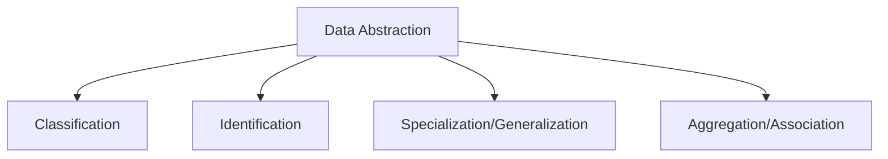

# 🧠 **DBMS – Data Abstraction & Knowledge Representation**  
### *From Raw Data to Intelligent Systems*

> 🔍 *Data abstraction hides complexity. Knowledge representation adds meaning.*  
> Together, they turn databases into **intelligent systems** — powering AI, semantic search, and enterprise decision-making.

Let’s explore how we **simplify reality** → then **model meaning** — using core concepts from DBMS and AI.

## 🎯 What is Data Abstraction?

> ✅ **Definition**:  
> **Data abstraction** = The process of **hiding complex details** and exposing only **essential features** of data.

Think:  
> 📦 A car dashboard → shows speed, fuel, temperature — not engine pistons or wiring.

In databases & AI:
- Focus on **what matters** → ignore noise
- Build models that are **manageable, scalable, and reusable**

---

## 🧩 4 Core Methods of Data Abstraction



---

### 1️⃣ **Classification & Instantiation**  
> 🗂️ Group similar objects → Create specific instances.

#### 🏢 Company Example:
```plaintext
          ┌─────────────┐       ┌─────────────┐
          │ JOB_APPLICANT│       │ COMPANY     │
          │ Name        │       │ Cname       │
          │ Ssn         │       │ Caddress    │
          │ Phone       │       │ Contact_name│
          └─────────────┘       └─────────────┘
```

> ✅ **Classification**: Group all applicants → `JOB_APPLICANT` class  
> ✅ **Instantiation**: Create specific instances → `John Doe`, `TechCorp`

> 💡 *Why?*  
> - Reuse common attributes across all applicants/companies  
> - Query by class → “Show all startups” → filter by `CompanyType`

---

### 2️⃣ **Identification**  
> 🔑 Assign unique identifiers → link entities across the system.

#### 🧾 Example:
```plaintext
          ┌─────────────┐       ┌─────────────┐
          │  PERSON     │       │  STUDENT    │
          │ Ssn         │       │ StudentID   │
          │ Name        │       │ Course      │
          └─────────────┘       └─────────────┘
```

> ✅ `Ssn` identifies a person → reused in `STUDENT` as FK  
> ❗ Without IDs → can’t link John Doe (person) to his student record

> 🛠️ *Best Practice*: Use surrogate keys (`StudentID`) when natural keys are long or changeable.

---

### 3️⃣ **Specialization & Generalization**  
> 🔍 Split or merge classes based on shared traits.

#### 🏢 Employee Hierarchy:
```plaintext
          ┌─────────────┐
          │  EMPLOYEE   │ ← Superclass
          └──────┬──────┘
                 │ IS-A
     ┌───────────┴───────────┐
     │                       │
┌─────────────┐        ┌─────────────┐
│ SECRETARY   │        │ ENGINEER    │
└─────────────┘        └─────────────┘
```

> ✅ **Specialization**: `EMPLOYEE` → `SECRETARY`, `ENGINEER`  
> ✅ **Generalization**: `FACULTY` + `STAFF` → `EMPLOYEE`

> 💡 *Power*: Inherit attributes → no redundancy → cleaner schema.

---

### 4️⃣ **Aggregation & Association**  
> 🧩 Combine entities → model complex relationships.

#### 🤝 Interview Example:
```plaintext
          ┌─────────────┐       ┌─────────────┐
          │ COMPANY     │       │ APPLICANT   │
          └──────┬──────┘       └──────┬──────┘
                 │                     │
          ┌──────▼──────┐        ┌──────▼──────┐
          │ INTERVIEW   │        │ JOB_OFFER   │
          │ Date        │        │ Salary      │
          │ ContactName │        │ StartDate   │
          └─────────────┘        └─────────────┘
```

> ✅ **Aggregation**: Treat `INTERVIEW` as a composite entity → links `COMPANY` + `APPLICANT` + `Date`  
> ✅ **Association**: Link `INTERVIEW` → `JOB_OFFER` via `RESULTS_IN` relationship

> ⚠️ *Avoid Assumptions*: Not every interview results in an offer → use optional participation.

---

## 🧬 What is Knowledge Representation (KR)?

> ✅ **Definition**:  
> **Knowledge Representation** = Modeling **meaning, rules, and relationships** — enabling **reasoning, inference, and decision-making**.

Unlike traditional databases (store facts), KR systems:

| Feature | Traditional DB | KR System |
|--------|----------------|-----------|
| **Purpose** | Store & retrieve data | Reason over knowledge |
| **Structure** | Schema + Instances | Ontologies + Rules |
| **Query** | SQL (declarative) | Logic rules, inference engines |
| **Example** | “Who works in Dept 5?” | “Who is eligible for promotion?” |

> 💡 *KR powers AI, expert systems, semantic search, and chatbots.*

---

## 🌐 Ontologies: The Language of Meaning

> ✅ **Definition**:  
> An **ontology** is a formal specification of **concepts, relationships, and rules** in a domain.

Think:  
> 📘 A dictionary + encyclopedia + rulebook — for machines.

#### 🧱 Key Components:
| Element | Description | Example |
|---------|-------------|---------|
| **Concepts** | Entities, attributes, relationships | `Applicant`, `Interview`, `JobOffer` |
| **Relationships** | How concepts connect | `Applicant → Interviews → JobOffer` |
| **Rules** | Logic for inference | “If Interview.Score > 80 → Offer.Salary = $70K” |

#### 🌐 Role in Semantic Web:
> 🌐 *Ontologies enable machines to understand context — even if data is structured differently.*

> 🎯 Example:  
> A job portal uses ontology to match:  
> - Applicant skills → Job requirements  
> - Company culture → Candidate preferences  
> → Despite different formats (JSON, XML, CSV)

> 💡 *Semantic Web = Web of Meaning, not just Data.*

---

## 🧪 Real-World Application: Employment Database

```plaintext
          ┌─────────────┐       ┌─────────────┐
          │ COMPANY     │       │ APPLICANT   │
          └──────┬──────┘       └──────┬──────┘
                 │                     │
          ┌──────▼──────┐        ┌──────▼──────┐
          │ INTERVIEW   │        │ JOB_OFFER   │
          │ Date        │        │ Salary      │
          │ ContactName │        │ StartDate   │
          └──────┬──────┘        └──────┬──────┘
                 │                     │
          ┌──────▼──────┐        ┌──────▼──────┐
          │ RESULTS_IN  │        │ REQUIRES    │
          └──────┬──────┘        └──────┬──────┘
                 │                     │
          ┌──────▼──────┐        ┌──────▼──────┐
          │ JOB_OFFER   │        │ SKILL_SET   │
          └─────────────┘        └─────────────┘
```

> ✅ **Aggregation**: `INTERVIEW` combines `COMPANY` + `APPLICANT`  
> ✅ **Association**: `RESULTS_IN` links `INTERVIEW` → `JOB_OFFER`  
> ✅ **Ontology**: Defines `SKILL_SET` → matches applicant skills to job requirements

---

## 🧭 Challenges & Opportunities

| Challenge | Opportunity |
|----------|-------------|
| 🚫 **Efficiency** — Complex models consume resources | 🚀 Optimize with indexing, caching, rule engines |
| 🔄 **Flexibility** — Balancing schema vs. instance data | 🧩 Use hybrid models (e.g., JSONB in PostgreSQL) |
| 🧩 **Ambiguity** — Natural language is messy | 🤖 NLP + ontologies → disambiguate meaning |
| 🌐 **Interoperability** — Systems speak different languages | 🌐 Ontologies → universal vocabulary |

> 💡 *Future Trend*: **Knowledge Graphs** (Google, Amazon, LinkedIn) — combine DBMS + KR + AI.

📌 **Quick Memory Hook:**

> 🗂️ **Classification** = Group similar → Instantiate specifics  
> 🔑 **Identification** = Unique ID → Link entities  
> 🔍 **Specialization** = Split general → detail  
> 📈 **Generalization** = Merge specific → simplify  
> 🧩 **Aggregation** = Combine → higher-level concept  
> 🧠 **Knowledge Rep.** = Add meaning → enable reasoning  
> 🌐 **Ontology** = Shared vocabulary → semantic web

> *“Abstraction hides complexity. Knowledge gives it purpose.”* 🌐✨
