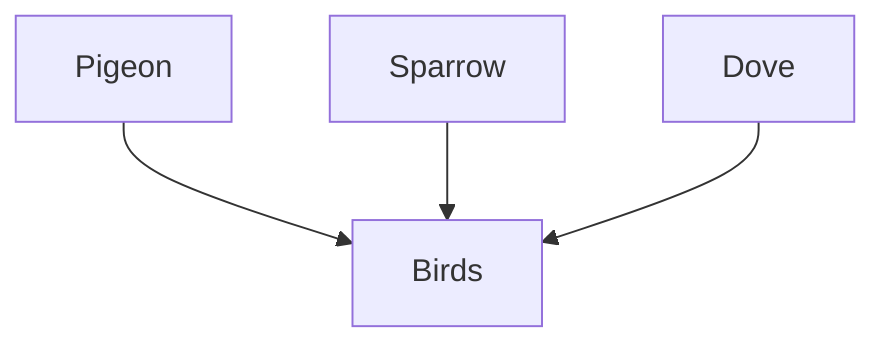
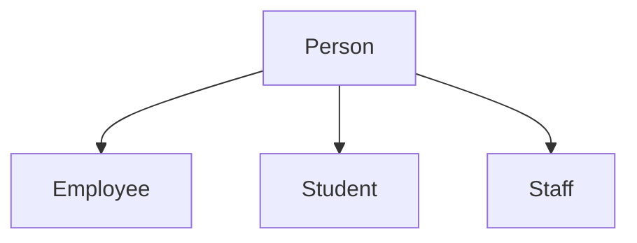
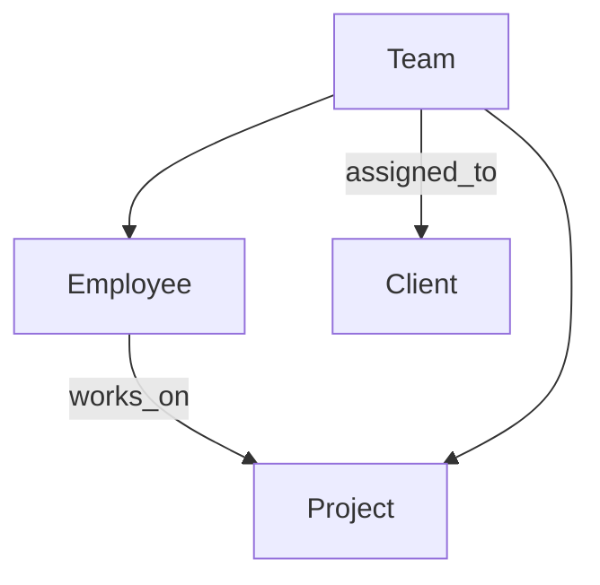

# 🔄 **DBMS – Generalization & Aggregation**  
### *Modeling Hierarchy: From Specific to General (and Back)*

> 🧭 *The ER model doesn’t just connect entities — it organizes them into **hierarchies**, allowing you to zoom in for detail or zoom out for overview.*

This is where **Generalization** (top-down) and **Specialization** (bottom-up) come in — powerful tools for modeling **inheritance**, **abstraction**, and **real-world categories**.

## 📈 1. Generalization: “Roll Up” to the Big Picture

> ✅ **Definition**:  
> **Generalization** = Combining **similar entities** into a **more general entity type** — based on shared attributes/relationships.

Think:  
> 🐦 `Pigeon`, `Sparrow`, `Dove` → 🐦 **Birds**



> 🎯 *Purpose*: Reduce redundancy, simplify design, enable abstraction.

---

### 🔍 Key Features of Generalization

| Feature | Description |
|--------|-------------|
| **Inheritance** | Generalized entity inherits attributes from all sub-entities |
| **IS-A Relationship** | Sub-entity “is a” instance of generalized entity (e.g., `Student IS-A Person`) |
| **Shared Attributes** | Common properties (e.g., `Name`, `Age`) move up to parent |

#### 🏫 School Example:
```plaintext
         ┌─────────────┐
         │   Person    │ ← Generalized Entity
         │ Name        │
         │ Age         │
         │ Gender      │
         └──────┬──────┘
                │ IS-A
     ┌──────────┴──────────┐
     │                     │
┌─────────────┐       ┌─────────────┐
│  Student    │       │  Teacher    │
│ RollNo      │       │ EmpID       │
└─────────────┘       └─────────────┘
```

> ✅ All students and teachers are persons → inherit `Name`, `Age`, `Gender`.

---

## 📉 2. Specialization: “Drill Down” to the Details

> ✅ **Definition**:  
> **Specialization** = Dividing a **general entity** into **sub-types** based on unique characteristics.

Think:  
> 👤 `Person` → 👨‍💼 `Employee`, 👩‍🎓 `Student`, 👨‍🔧 `Staff`



> 🎯 *Purpose*: Capture domain-specific details while reusing common structure.

---

### 🔍 Key Features of Specialization

| Feature | Description |
|--------|-------------|
| **Sub-Entities** | More specific types (e.g., `Undergrad`, `Graduate`) |
| **Unique Attributes** | Add specialized fields (e.g., `GPA` for Student, `Salary` for Employee) |
| **Disjoint / Overlapping** | Can an entity be in multiple sub-sets? (e.g., Can someone be both Student AND Staff?) |

#### 🏢 Company Example:
```plaintext
         ┌─────────────┐
         │   Person    │
         │ Name        │
         │ DOB         │
         └──────┬──────┘
                │ IS-A
     ┌──────────┴──────────┐
     │                     │
┌─────────────┐       ┌─────────────┐
│  Employee   │       │  Customer   │
│ EmpID       │       │ CustID      │
│ Salary      │       │ CreditLimit │
└─────────────┘       └─────────────┘
```

> 💡 *Can a person be both Employee and Customer?* → Use **overlapping specialization** if yes.

---

## 🧬 3. Inheritance: The Power of “IS-A”

> ✅ **Definition**:  
> Lower-level entities **inherit** attributes and relationships from their parent.

#### 🧠 How It Works:
- Parent entity defines **common attributes** → inherited by children.
- Children add **unique attributes** → no duplication.

#### 📋 Example:

```plaintext
          ┌─────────────┐
          │   Person    │ ← Parent
          │ Name        │
          │ Age         │
          │ Gender      │
          └──────┬──────┘
                 │ IS-A
     ┌───────────┴───────────┐
     │                       │
┌─────────────┐        ┌─────────────┐
│  Student    │        │  Teacher    │
│ RollNo      │        │ EmpID       │
│ GPA         │        │ Dept        │
└─────────────┘        └─────────────┘
```

> ✅ `Student` inherits `Name`, `Age`, `Gender` → adds `RollNo`, `GPA`  
> ✅ `Teacher` inherits same → adds `EmpID`, `Dept`

---

## 🖼️ ER Diagram Notation: Generalization/Specialization

```plaintext
          ┌─────────────┐
          │   Person    │
          └──────┬──────┘
                 │
            ┌────▼────┐
            │  IS-A   │ ← Triangle (Chen notation)
            └────┬────┘
     ┌───────────┴───────────┐
     │                       │
┌─────────────┐        ┌─────────────┐
│  Student    │        │  Teacher    │
└─────────────┘        └─────────────┘
```

> 📌 **Symbols**:
> - ▼ **Triangle** = IS-A relationship  
> - **Single line** = Total participation (every person is either student or teacher)  
> - **Double line** = Partial participation (some persons may not be students/teachers)

---

## 🧩 4. Aggregation: Modeling “Has-A” Relationships

> ✅ **Definition**:  
> **Aggregation** = Treating a **relationship + its participating entities** as a **higher-level entity** — to model complex “has-a” structures.

Think:  
> 👥 `Employee` — works_on → 📂 `Project` → can be aggregated as `Team`  
> → Now `Team` can participate in another relationship (e.g., `Team` — assigned_to → `Client`)



> 🎯 *Why?* To avoid over-complicating diagrams with multi-way relationships.

---

### 🏢 Real-World Aggregation Example: University System

```plaintext
          ┌─────────────┐       ┌─────────────┐
          │  Student    │───────│  Course     │
          └──────┬──────┘       └──────┬──────┘
                 │                      │
             ┌───▼───┐              ┌───▼───┐
             │Enrolls│              │Teaches│
             └───┬───┘              └───┬───┘
                 │                      │
          ┌──────▼──────┐        ┌──────▼──────┐
          │ Enrollments │        │ Teachings   │
          └──────┬──────┘        └──────┬──────┘
                 │                      │
                 └──────────┬───────────┘
                            │
                    ┌───────▼───────┐
                    │  AcademicPlan │ ← Aggregated Entity
                    └───────────────┘
```

> ✅ Now `AcademicPlan` can have attributes like `Semester`, `Status` — and participate in relationships like `ApprovedBy(Dean)`.

---

## 🧭 When to Use Generalization vs. Aggregation?

| Scenario | Use |
|----------|-----|
| “A is a kind of B” | → **Generalization** (e.g., `Student IS-A Person`) |
| “A has a B” | → **Aggregation** (e.g., `Team HAS Employees and Projects`) |
| “Multiple entities form a new concept” | → **Aggregation** (e.g., `OrderItem` aggregates `Product + Quantity`) |

---

## 🧪 Quick Self-Check

| Question | Answer |
|---------|--------|
| Is `Student` a specialization of `Person`? | ✅ Yes |
| Does `Employee` inherit `Name` from `Person`? | ✅ Yes |
| Can aggregation model a “team of employees working on a project”? | ✅ Yes |
| Is “Birds” a generalization of “Pigeon”? | ✅ Yes |
| Can a person be both `Student` and `Employee`? | ✅ If overlapping specialization allowed |

📌 **Quick Memory Hook:**

> 📈 **Generalization** = Zoom Out → Combine similar → “IS-A”  
> 📉 **Specialization** = Zoom In → Split general → “IS-A”  
> 🧬 **Inheritance** = Child gets parent’s traits  
> 🧩 **Aggregation** = Treat relationship as entity → “HAS-A”

> *“Hierarchy isn’t complexity — it’s clarity.”* 🌳✨
