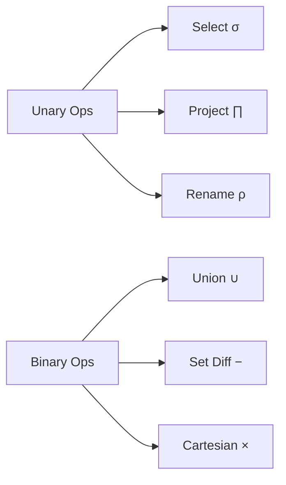

# 🧮 **DBMS – Relational Algebra**  
### *The Calculus of Data: Querying with Math, Not Magic*

> 🔢 *Relational Algebra is the **procedural backbone** of SQL — where every `SELECT`, `JOIN`, and `WHERE` has a mathematical twin.*  
> It’s **not just theory** — it’s how databases *actually* execute your queries.

Let’s break down the 6 core operations — with clean notation, visual analogies, and runnable logic.


## 🧠 What is Relational Algebra?

> ✅ **Definition**:  
> A **procedural query language** that takes **relations (tables)** as input and returns **relations** as output — using **operators**.

| Feature | Relational Algebra | SQL |
|--------|---------------------|-----|
| **Style** | Procedural (how to compute) | Declarative (what to get) |
| **Foundation** | Set theory + logic | Based on relational algebra |
| **Use** | Query optimization, DB internals | User-facing language |

> 💡 *Think of it as “assembly language for databases”* — SQL compiles down to relational algebra plans.

---

## 🔁 The 6 Fundamental Operations



---

### 1️⃣ **Select (σ) — Filter Rows**  
> ✅ **“Give me rows that match this condition.”**

- **Notation**: `σ<sub>predicate</sub>(R)`  
- **Type**: Unary (1 input relation)  
- **Output**: Subset of `R` (same schema)

#### 📋 Examples:
| Expression | Meaning |
|-----------|---------|
| `σ<sub>subject="DBMS"</sub>(Books)` | Books where subject = "DBMS" |
| `σ<sub>price > 500 ∧ year > 2020</sub>(Books)` | Expensive, recent books |
| `σ<sub>author="Codd" ∨ author="Date"</sub>(Books)` | Books by Codd or Date |

> 🎯 *Like `WHERE` in SQL*.

---

### 2️⃣ **Project (∏) — Filter Columns**  
> ✅ **“Give me only these columns — and remove duplicates.”**

- **Notation**: `∏<sub>A₁, A₂, ..., Aₙ</sub>(R)`  
- **Type**: Unary  
- **Output**: Relation with only selected attributes (duplicates removed!)

#### 📋 Examples:
| Expression | Meaning |
|-----------|---------|
| `∏<sub>title, author</sub>(Books)` | Titles and authors only |
| `∏<sub>author</sub>(Books)` | Unique authors (no duplicates!) |
| `∏<sub>dept</sub>(Employee)` | All departments (collapsed list) |

> 🎯 *Like `SELECT col1, col2` in SQL (with `DISTINCT` implied)*.

---

### 3️⃣ **Union (∪) — Combine Rows**  
> ✅ **“Give me all rows from A and B — no duplicates.”**

- **Notation**: `R ∪ S`  
- **Type**: Binary  
- **Requirements**:  
  - Same number of attributes  
  - Compatible domains (e.g., both `VARCHAR`)  

#### 📋 Example:
```sql
∏<sub>author</sub>(Books) ∪ ∏<sub>author</sub>(Articles)
```
→ Authors who wrote **books OR articles** (or both — duplicates removed).

> 🎯 *Like `UNION` in SQL*.

---

### 4️⃣ **Set Difference (−) — Subtract Rows**  
> ✅ **“Give me rows in A that are NOT in B.”**

- **Notation**: `R − S`  
- **Type**: Binary  
- **Requirements**: Same schema

#### 📋 Example:
```sql
∏<sub>author</sub>(Books) − ∏<sub>author</sub>(Articles)
```
→ Authors who wrote **books but no articles**.

> 🎯 *Like `EXCEPT` (PostgreSQL) or `MINUS` (Oracle)*.

---

### 5️⃣ **Cartesian Product (×) — All Pairings**  
> ✅ **“Combine every row of A with every row of B.”**

- **Notation**: `R × S`  
- **Type**: Binary  
- **Output**: All possible combinations (|R| × |S| rows)

#### 📋 Example:
```sql
Books × Articles
```
→ Every book paired with every article → often used as basis for joins.

> 💡 *Rarely used alone — almost always filtered with `σ`.*

#### 🔗 With Select (→ Simulated Join):
```sql
σ<sub>Books.author = Articles.author</sub>(Books × Articles)
```
→ Books and articles by the *same author* → **equivalent to `INNER JOIN`**.

---

### 6️⃣ **Rename (ρ) — Give It a Name**  
> ✅ **“Call this result something meaningful.”**

- **Notation**: `ρ<sub>new_name</sub>(E)`  
- **Type**: Unary  
- **Use**: Name intermediate results or disambiguate attributes.

#### 📋 Example:
```sql
ρ<sub>BestBooks</sub>(σ<sub>rating > 4.5</sub>(Books))
```
→ Store high-rated books as `BestBooks` for later use.

> 🎯 *Like `AS` in SQL subqueries*.

---

## 🧩 Additional Operations (Derived from Basics)

| Operation | Symbol | Meaning | SQL Equivalent |
|----------|--------|---------|----------------|
| **Intersection** | `R ∩ S` | Rows in *both* R and S | `INTERSECT` |
| **Natural Join** | `R ⨝ S` | Join on *common attributes*, remove duplicates | `NATURAL JOIN` |
| **Theta Join** | `R ⨝<sub>θ</sub> S` | `σ<sub>θ</sub>(R × S)` | `JOIN ... ON condition` |
| **Division** | `R ÷ S` | “For all” — advanced (see next section) | — |

> 💡 *All can be expressed using σ, ∏, ×, ∪, − — but shortcuts exist for convenience.*

---

## 🧠 Relational Calculus: The Declarative Twin

> ✅ **Relational Calculus** = *What* to fetch (not how)  
> — the foundation of SQL’s logic.

| Type | Variable Range | Notation | Example |
|------|----------------|----------|---------|
| **Tuple Relational Calculus (TRC)** | Over **tuples** | `{ T \| Condition }` | `{ T \| Book(T) ∧ T.subject = "DBMS" }` |
| **Domain Relational Calculus (DRC)** | Over **attribute values** | `{ a, b \| P(a,b) }` | `{ title, author \| Book(title, author, "DBMS") }` |

> 🔁 **Codd’s Theorem**:  
> *Relational Algebra ≡ TRC ≡ DRC* → all equally expressive.

---

## 🖼️ Visual Summary: Algebra vs. Calculus

```plaintext
          Relational Query Languages
                     │
         ┌───────────▼───────────┐
         │                       │
   Procedural             Declarative
   (How?)                 (What?)
         │                       │
┌────────▼────────┐     ┌────────▼────────┐
│ Relational       │     │ Relational       │
│ Algebra          │     │ Calculus         │
│ σ, ∏, ×, ∪, −    │     │ TRC, DRC         │
└──────────────────┘     └──────────────────┘
         │                       │
    Query Execution        Query Specification
    (Optimizer plans)      (SQL is based on this)
```

---

## 🧪 Quick Self-Check

| SQL | Relational Algebra |
|-----|--------------------|
| `SELECT title FROM Books WHERE price < 200;` | `∏<sub>title</sub>(σ<sub>price<200</sub>(Books))` |
| `SELECT * FROM Books b JOIN Authors a ON b.author = a.name;` | `σ<sub>b.author = a.name</sub>(Books × Authors)` |
| `SELECT author FROM Books MINUS SELECT author FROM Articles;` | `∏<sub>author</sub>(Books) − ∏<sub>author</sub>(Articles)` |


📌 **Quick Memory Hook:**

> 🔍 **σ** = Select rows (WHERE)  
> 📤 **∏** = Project columns (SELECT cols)  
> ➕ **∪** = Union (OR + dedupe)  
> ➖ **−** = Difference (NOT IN)  
> ✖️ **×** = Cartesian (all pairs)  
> 🏷️ **ρ** = Rename (AS)

> *“Relational algebra is the grammar of data — once you know it, SQL reads like poetry.”* 📜✨
