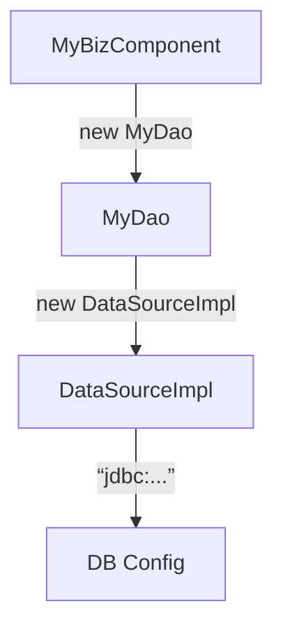
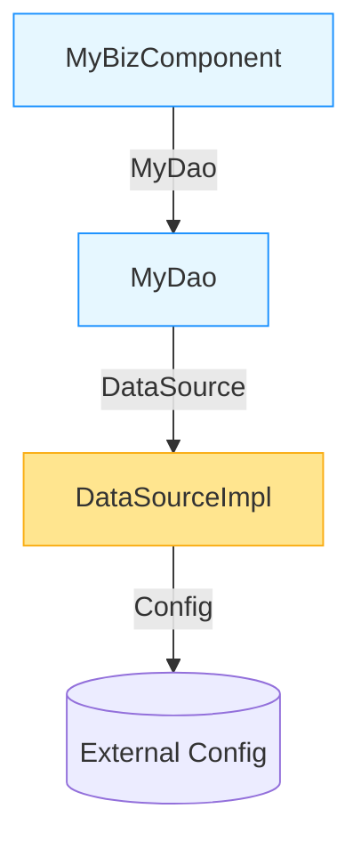

# 📘 Chapter 1: Dependency Injection — Beyond the Buzzword  
*Making Collaboration Explicit, Not Assumed*

> “Objects should not *reach out* to get what they need — they should *receive* it.  
> That simple inversion changes everything.”  
> — *Inspired by Martin Fowler, refined in production*

## 🔍 The Core Problem: Hardcoded Dependencies and Their Hidden Costs

Let’s begin not with definitions, but with **pain** — the kind every developer has felt.

### 🧱 A “Simple” DAO — With a Hidden Time Bomb

```java
public class MyDao {
    protected DataSource dataSource =
        new DataSourceImpl("driver", "url", "user", "password");

    public Person readPerson(int primaryKey) {
        // uses dataSource to fetch data...
    }
}
```

At first glance: straightforward.  
But look deeper. This class has **five dependencies** — and only *one* is visible in its interface:

| Dependency | Visibility | Flexibility | Testability |
|-----------|------------|-------------|-------------|
| `DataSource` interface | ✅ Public contract | ❌ None | ❌ Can’t mock |
| `DataSourceImpl` class | ❌ Hardcoded | ❌ Zero | ❌ Forced real DB |
| `"driver"` string | ❌ Hardcoded | ❌ None | ❌ Can’t test dev DB |
| `"url"`, `"user"`, `"password"` | ❌ Hardcoded | ❌ None | ❌ Credentials in code! |

> 💥 **Critical Insight**:  
> When a class satisfies its *own* dependencies, it **absorbs the coupling** of every layer beneath it.

You thought you were writing a `MyDao`.  
In reality, you wrote:  
→ `MyDao` **+** `DataSourceImpl` **+** JDBC config **+** network assumptions.

This is not modularity. This is **monolith-by-default**.


### 📉 The Tangible Costs

| Scenario | Without DI | With DI |
|---------|------------|---------|
| **Switch databases** | Edit & recompile every DAO | Change config file |
| **Run unit test** | Requires live DB → slow, flaky | Inject mock → 2ms, deterministic |
| **Deploy to staging** | Recompile with new credentials | External config only |
| **Add retry logic** | Modify every DAO’s constructor | Wrap `DataSource` in `RetryingDataSource` — *zero* DAO changes |

The cost isn’t theoretical — it’s in **build times**, **test flakiness**, **deployment risk**, and **developer morale**.


## 🔁 Dependency Injection Defined: A Precise, Actionable Definition

> **Dependency Injection (DI)** is a design pattern where **an object’s collaborators are provided (“injected”) by an external entity at construction or configuration time — rather than the object instantiating them itself.**

It is a specific form of **Inversion of Control (IoC)** — shifting *who controls the creation* of dependencies.

### 🧩 The 3 Injection Styles — When to Use Which

| Style | Syntax | When to Use | Risks |
|------|--------|-------------|-------|
| **Constructor Injection** | `new Service(dep1, dep2)` | ✅ **Default choice**<br>— Immutable state<br>— Required dependencies obvious<br>— Safe for testing | ❌ Verbose with >5 deps (but that’s a code smell!) |
| **Setter Injection** | `service.setDep(dep)` | ✅ Optional dependencies<br>✅ Reconfigurable post-creation (e.g., UI controls) | ❌ Object may be in invalid state<br>❌ Harder to reason about lifecycle |
| **Field Injection** | `@Inject private Dep dep;` | ⚠️ Only for framework-managed beans (e.g., Spring `@Component`) | ❌ Breaks encapsulation<br>❌ Impossible to test without reflection |

> ✅ **Industry Consensus (Spring, Jakarta EE, Google Guice)**:  
> **Constructor injection is the default**. Setters for optional/reconfigurable deps. Field injection only when forced by framework constraints.

## 🛠️ Refactoring Step-by-Step: From Hardcoded to Injected

Let’s evolve `MyDao` — not in one leap, but in **realistic, incremental steps**.

### Step 1: Move Construction to Constructor (Partial DI)

```java
public class MyDao {
    protected DataSource dataSource;

    public MyDao(String driver, String url, String user, String password) {
        this.dataSource = new DataSourceImpl(driver, url, user, password);
    }

    public Person readPerson(int primaryKey) { ... }
}
```

✅ **Gain**: Configuration is now external — no recompile to change DB.  
❌ **Still coupled** to `DataSourceImpl` and its 4-arg constructor.

> 📌 *This is where many tutorials stop — but it’s only halfway.*

### Step 2: Inject the Abstraction, Not the Implementation

```java
public class MyDao {
    protected DataSource dataSource;

    public MyDao(DataSource dataSource) {  // ← Inject the interface!
        this.dataSource = Objects.requireNonNull(dataSource);
    }

    public Person readPerson(int primaryKey) { ... }
}
```

✅ **Now**:  
- `MyDao` depends *only* on `javax.sql.DataSource` — a standard Java interface  
- You can inject `MockDataSource`, `PoolingDataSource`, `CachingDataSource` — *without touching `MyDao`*  
- Unit tests become trivial:

```java
@Test
void readsPerson() {
    DataSource mockDs = mock(DataSource.class);
    MyDao dao = new MyDao(mockDs);  // ✅ Inject mock
    when(mockDs.getConnection()).thenReturn(...);
    Person p = dao.readPerson(123);
    assertThat(p.name()).isEqualTo("Alice");
}
```

> 💡 **Key Realization**:  
> DI isn’t about *containers* — it’s about **designing for replaceability**.  
> The container just automates what you *could* do by hand.


## 🔗 Dependency Injection Chaining: Why One Layer Isn’t Enough

Here’s where beginners get stuck — and where the **true power** of DI emerges.

### ❌ The “Dependency Pushdown” Anti-Pattern

```java
public class MyBizComponent {
    public void changePersonStatus(Person person, String status) {
        MyDao dao = new MyDao(
            new DataSourceImpl("driver", "url", "user", "password")  // ← Still here!
        );
        Person p = dao.readPerson(person.getId());
        p.setStatus(status);
        dao.update(p);
    }
}
```

You fixed `MyDao` — but now `MyBizComponent` **carries the burden** of `DataSourceImpl` and its config.

- `MyBizComponent` depends on layers it doesn’t own (DAO, JDBC)  
- Changes to DB config ripple up *every layer*  
- Testing `MyBizComponent` still requires real DB

This is **dependency carrying** — passing config through layers that don’t use it.

### ✅ The Fix: Chain Injection Upward

```java
public class MyBizComponent {
    private final MyDao dao;

    public MyBizComponent(MyDao dao) {  // ← Inject DAO, not DataSource!
        this.dao = Objects.requireNonNull(dao);
    }

    public void changePersonStatus(Person person, String status) {
        Person p = dao.readPerson(person.getId());
        p.setStatus(status);
        dao.update(p);
    }
}
```

Now:
- `MyBizComponent` depends *only* on `MyDao`  
- `MyDao` depends *only* on `DataSource`  
- No layer knows about JDBC strings or `DataSourceImpl`

And the wiring is **external**:
```java
// Manual wiring (no container)
DataSource ds = new DataSourceImpl("dev", "jdbc:h2:mem:test", "sa", "");
MyDao dao = new MyDao(ds);
MyBizComponent biz = new MyBizComponent(dao);
```

> 🌐 **This is DI in its purest form** — no framework needed.  
> A container just *scales* this pattern across 1000+ objects.


### 📊 Mermaid: Dependency Flow Comparison

#### ❌ Hardcoded (Rigid, Brittle)


#### ✅ DI Chained (Flexible, Testable)


- Blue: **Application logic** — stable, testable, reusable  
- Yellow: **Infrastructure** — swappable, externalized  


## 🧱 Why a Container Becomes Necessary

At small scale, manual DI works:
```java
Service s = new Service(new Repo(new DbConfig(...)), new Logger());
```

But at scale (~50+ objects), you face:

| Problem | Manual DI | With Container |
|--------|-----------|----------------|
| **Boilerplate** | 20-line main() just to wire objects | Declarative config (XML, annotations, DSL) |
| **Singletons** | Manual `static INSTANCE` — thread-unsafe, hard to test | `@Singleton` or `1 factory = ...` |
| **Lifecycle** | `try { ... } finally { ds.close(); }` everywhere | Container calls `@PreDestroy` or `dispose{}` |
| **Scoped deps** | ThreadLocal hacks for request-scoped beans | `@RequestScoped` handled automatically |

> 🎯 **Container = Orchestrator of Object Graphs**  
> It doesn’t “do DI” — it *assembles the graph* so *you* can focus on *what the objects do*.


## ✅ Recap: The DI Mindset Shift

| Old World | DI World |
|----------|----------|
| “I know how to get what I need.” | “Tell me what I need — I’ll use it.” |
| Dependencies hidden in implementation | Dependencies explicit in constructor |
| Testing requires real infrastructure | Testing uses mocks — fast & reliable |
| Changes ripple through code | Changes confined to configuration |
| Objects are *self-sufficient* | Objects are *collaborative* |

This isn’t just code hygiene — it’s **engineering honesty**.  
You’re no longer hiding dependencies — you’re declaring them openly.