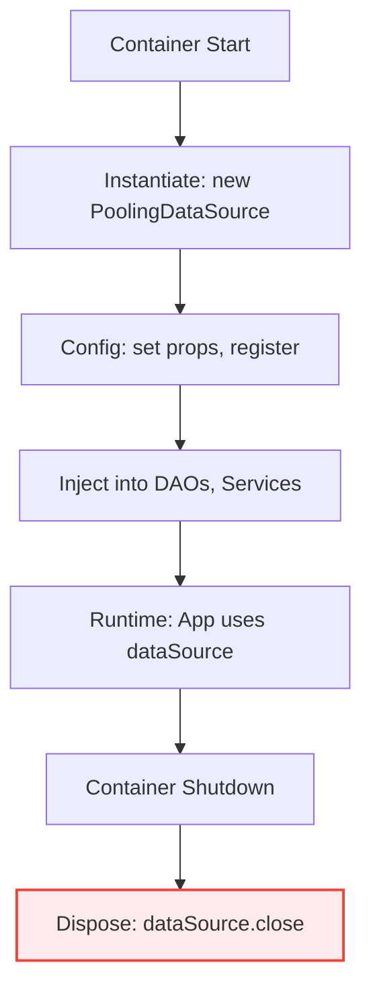
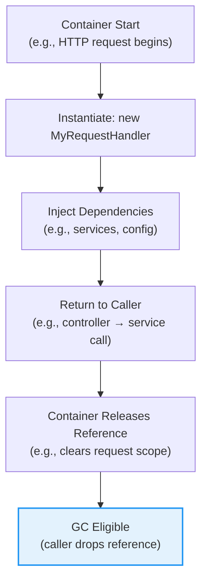

# 📘 Chapter 10: Dependency Injection Containers — Life Cycle Management  
*Beyond Creation: Graceful Release, Shutdown, and Resource Safety*

> “A factory builds. A container *stewards*.  
> The difference isn’t semantics — it’s responsibility.”  
> — *Inspired by your knowledge base*

In Chapter 9, we saw *how* Butterfly builds objects via chained factories.  
Now we answer the final, critical question:  
> ❓ *“Who cleans up when the work is done?”*

Let’s explore how DI containers don’t just *inject* — they *manage*, *protect*, and *release*.

## 🔁 Why “Container” ≠ “Factory” — The Naming Matters

Your knowledge base opens with a vital distinction:

> *“The reason it is called a ‘container’ and not a ‘factory’ is that the container often takes on more responsibility than just instantiating objects and injecting dependencies… The fact that the container sometimes keeps a reference to the components after instantiation is the reason it is called a ‘container’.”*

This isn’t pedantry — it’s about **responsibility**.

| Role | Responsibility | Example |
|------|----------------|---------|
| **Factory** | *Create* objects | `new MyObject()` |
| **Container** | *Create, configure, track, release* objects | `dataSource`; `dispose{ $ds.close(); }` |

> ✅ **Key Insight**:  
> Containers only retain references **when they must** — for life cycle management or reuse (singletons/flyweights).  
> For prototype (`*`) beans? They’re forgotten immediately — no memory leak.

## 🧱 The Life Cycle Phases — Beyond `@PostConstruct`

Your text reveals a clean, powerful model:

| Phase | When | Purpose | Butterfly Syntax |
|-------|------|---------|------------------|
| **Instantiation** | `new` or constructor call | Build the object | `* com.MyObject()` |
| **Configuration** | After instantiation | Set properties, register, warm caches | `config{ $registry.register($this); }` |
| **Usage** | Runtime | Business logic — container hands off | — |
| **Disposal** | Shutdown or scope end | Release resources (DB, network, files) | `dispose{ $ds.close(); }` |

### ✅ The `dispose{}` Phase — A Deliberate Superpower

Your example nails it:
```js
dataSource = 1 com.thirdparty.PoolingDataSource();
dispose { 
    $dataSource.close(); 
}
```

- ✅ Runs when container shuts down (`container.dispose()`)  
- ✅ Can reference *any* singleton (`$dataSource`, `$cache`, `$logger`)  
- ✅ No reflection — plain method calls  
- ✅ Thread-safe (executed in shutdown hook)

> 💡 **Real Use Cases**:  
> - Close DB connection pools  
> - Drain async queues before shutdown  
> - Flush caches to disk  
> - Log final metrics


### 🖼️ Mermaid: Life Cycle of a Singleton



Contrast with prototype beans (`*`):


> ✅ **No tracking** → no memory pressure → scales to 10k+ requests/sec

---

## 📦 What the Container Tracks (and What It Doesn’t)

Your knowledge base is refreshingly precise:

> *“Dependency injection containers usually only keep a reference to objects it needs to manage life cycles for, or that are reused for future injections, like singletons or flyweights. When configured to create new instances… the container usually just forgets about the created object.”*

### ✅ Tracked (Retained)
| Type | Why |
|------|-----|
| `1` (Singleton) | Reused across app; needs `dispose{}` |
| `#` (Factory) | May be reused (e.g., `#myDao` for local instances) |
| Objects with `dispose{}` | Must be notified on shutdown |

### ❌ Not Tracked (Forgotten)
| Type | Why |
|------|-----|
| `*` (Prototype) | One-and-done — caller owns lifecycle |
| Local factory outputs (e.g., `["a","b"]`) | Stateless, GC-friendly |

> 🚀 **Performance Win**:  
> Butterfly’s memory footprint scales with *configured singletons*, not *total object count*.  
> 1000 request handlers? → 0 container references.  
> 10 singletons? → 10 references.

## 🌐 Modern Context: How This Informs Today’s DI

| Butterfly Innovation | Modern Equivalent |
|----------------------|-------------------|
| **`dispose{}` phase** | Spring `@PreDestroy` + `DisposableBean` (but only on beans) |
| **Explicit tracking** | Jakarta EE `@PreDestroy` (same limitation) |
| **Shutdown hook integration** | Spring Boot `ApplicationRunner` + `@EventListener(ContextClosedEvent)` |
| **No tracking for prototypes** | Dagger 2 (compile-time, no runtime GC pressure) |

> ⚠️ **The Gap**:  
> Spring’s `@PreDestroy` only works on *managed beans* — not on `DataSource` you inject manually.  
> Butterfly’s `dispose{}` works on *any* singleton — even third-party classes with no annotations.


## ✅ Recap: The Life Cycle Trinity

| Principle | Implementation | Benefit |
|----------|----------------|---------|
| **Track Only What You Must** | Singletons + `dispose{}` | Low memory, high scalability |
| **Dispose = First-Class Phase** | `dispose{ $x.close(); }` | Safe shutdown, no leaks |
| **Forget the Rest** | Prototypes (`*`) auto-GC’d | No memory pressure |

This isn’t academic — it’s the difference between:
- ❌ *“Our app leaks DB connections on restart.”*  
- ✅ *“We shut down cleanly in <100ms — zero leaks.”*
