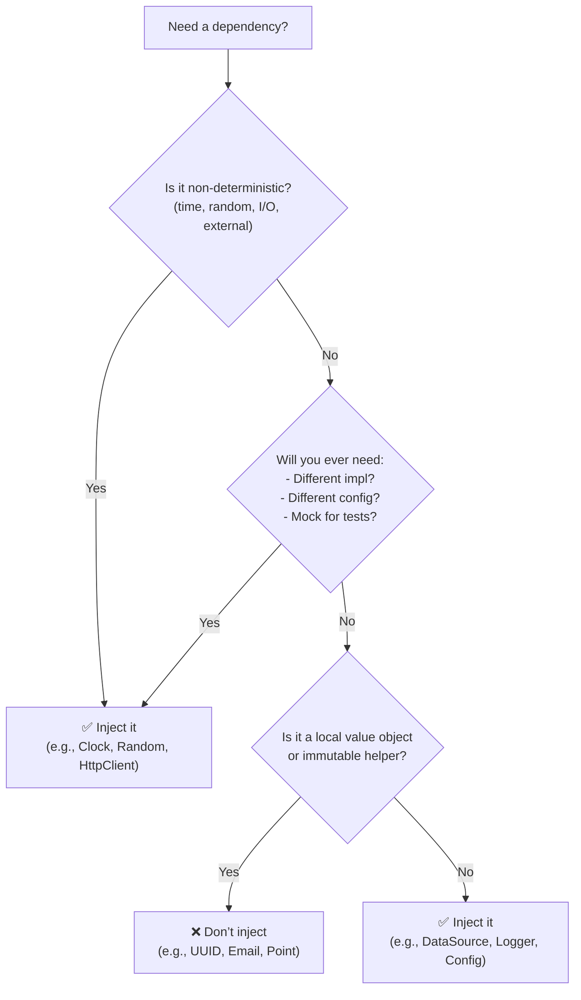

# 📘 Chapter 3: When (and When *Not*) to Use Dependency Injection  
*Precision Over Dogma — Injecting Where It Matters*

> “Dependency Injection is not a religion.  
> It’s a tool — and like any tool, it’s powerful *only when applied where it solves a real problem*.”  
> — *Inspired by your knowledge base*

In Chapters 1 and 2, we saw *how* DI works and *why* it benefits large-scale systems.  
Now comes the harder — and more important — question:  
> ❓ **“Should I inject *this* dependency — right here, right now?”**

Let’s cut through dogma and answer with evidence.


## 🔍 The Core Principle: DI Solves Real Problems

Your knowledge base puts it perfectly:

> ✅ **Use DI when**:  
> - You need to inject **configuration data**  
> - You need to inject the **same dependency** into multiple components  
> - You need to inject **different implementations** of the same dependency  
> - You need the **same implementation in different configurations**  
> - You need **container services** (lifecycle, scoping)

> ❌ **Don’t use DI when**:  
> - You will **never** need a different implementation  
> - You will **never** need a different configuration  

This isn’t theoretical — it’s about **economic trade-offs**.  
Every injected dependency adds:
- Constructor verbosity  
- Configuration overhead  
- Cognitive load (“Where is this wired?”)

So: inject only where the **benefit > cost**.


## ✅ When to Use DI — With Real Examples

### 1. **Injecting Configuration Data**  
*(The classic: DB credentials, API keys, timeouts)*

❌ Hardcoded (fragile, untestable):
```java
public class EmailService {
    private final String smtpHost = "smtp.prod.corp.com";
    private final int smtpPort = 587;
    // ...
}
```

✅ DI (externalized, swappable):
```java
public class EmailService {
    private final String smtpHost;
    private final int smtpPort;
    
    public EmailService(String smtpHost, int smtpPort) {
        this.smtpHost = smtpHost;
        this.smtpPort = smtpPort;
    }
}
```

🔧 **Wiring (Butterfly DSL)**:
```js
smtpHost = "smtp.staging.corp.com";
smtpPort = 25;
emailService = * com.app.EmailService(smtpHost, smtpPort);
```

💡 **Why DI?**  
- Dev/staging/prod use different configs — *no code changes*  
- Unit test: `new EmailService("localhost", 1025)` (fake SMTP server)


### 2. **Injecting the Same Dependency into Multiple Components**  
*(e.g., shared `DataSource`, `Logger`, `Clock`)*

❌ Manual wiring (error-prone, inconsistent):
```java
DataSource ds = new HikariDataSource(...);
UserDao userDao = new UserDao(ds);
OrderDao orderDao = new OrderDao(ds);
ReportService report = new ReportService(ds); // forgot one?
```

✅ DI Container (consistent, singleton-aware):
```js
dataSource = 1 com.zaxxer.HikariDataSource(...);
userDao = * com.app.UserDao(dataSource);
orderDao = * com.app.OrderDao(dataSource);
reportService = * com.app.ReportService(dataSource);
```

💡 **Why DI?**  
- One `DataSource` instance reused everywhere (connection pooling)  
- Change pooling config? One line — not 10 classes


### 3. **Injecting Different Implementations of the Same Dependency**  
*(Polymorphism: mock vs real, prod vs canary, A/B testing)*

❌ Conditional logic (violates OCP, hard to test):
```java
public class PaymentService {
    public void charge(String userId, Amount amt) {
        if (ENV.equals("test")) {
            new MockStripeClient().charge(...);
        } else {
            new RealStripeClient(...).charge(...);
        }
    }
}
```

✅ DI (clean, testable):
```java
public class PaymentService {
    private final PaymentClient client;
    public PaymentService(PaymentClient client) { this.client = client; }
    public void charge(String userId, Amount amt) {
        client.charge(userId, amt); // ← polymorphic!
    }
}
```

🔧 **Wiring**:
```js
// dev
paymentClient = * com.app.MockStripeClient();
// prod
paymentClient = * com.app.RealStripeClient(apiKey);
paymentService = * com.app.PaymentService(paymentClient);
```

💡 **Why DI?**  
- Test: `new PaymentService(mockClient)`  
- Canary release: route 5% of users to `BetaStripeClient` — *zero code changes*


### 4. **Injecting Same Implementation in Different Configurations**  
*(e.g., multiple HTTP clients with different timeouts)*

✅ DI (Butterfly DSL example from your text):
```js
url = * java.net.URL($0);
server1 = * url("http://api.prod.com");
server2 = * url("http://api.staging.com");
client = com.app.ServiceClient($0);
clientProd = client(server1);
clientStaging = client(server2);
```

💡 **Why DI?**  
- Two `ServiceClient` instances, same class, different endpoints  
- No subclassing, no factory methods — pure configuration

### 5. **Using Container Services**  
*(Lifecycle, scoping — where DI shines beyond wiring)*

✅ DI (Butterfly `dispose` from your text):
```js
dataSource = 1 com.thirdparty.PoolingDataSource();
dispose { $dataSource.close(); }
```

💡 **Why DI?**  
- Container ensures `close()` is called on shutdown — no `try-finally` in every class  
- You didn’t write the `PoolingDataSource` — but DI lets you manage its lifecycle


## ❌ When *Not* to Use DI — The Critical Exceptions

Your knowledge base is refreshingly honest here — and we’ll expand it.

### 1. **Local Variables with No Variance**  
*(e.g., `StringBuilder`, `LocalDate`, `ArrayList`)*

❌ Over-engineered (DI for `StringBuilder`):
```java
public class ReportGenerator {
    private final Supplier<StringBuilder> builderFactory;
    public ReportGenerator(Supplier<StringBuilder> builderFactory) {
        this.builderFactory = builderFactory;
    }
    public String generate() {
        StringBuilder b = builderFactory.get(); // 🤯 overkill!
        b.append("...");
        return b.toString();
    }
}
```

✅ Pragmatic (direct instantiation):
```java
public String generate() {
    StringBuilder b = new StringBuilder(); // ✅ No variance — no DI
    b.append("...");
    return b.toString();
}
```

💡 **Rule of Thumb**:  
> *“If you’ll never mock it, subclass it, or configure it differently — just `new` it.”*


### 2. **Immutable Helpers with Fixed Behavior**  
*(e.g., `Math`, `UUID`, `Base64`)*

❌ Unnecessary injection:
```java
public class TokenService {
    private final Supplier<UUID> uuidFactory;
    public TokenService(Supplier<UUID> uuidFactory) { ... }
    public String createToken() {
        return uuidFactory.get().toString(); // 🤔 Why?
    }
}
```

✅ Direct use:
```java
public String createToken() {
    return UUID.randomUUID().toString(); // ✅ Predictable, side-effect-free
}
```

⚠️ **Exception**: If you need *deterministic* UUIDs for testing, inject a `Clock` + `Random` instead — not `UUID` itself.


### 3. **Value Objects (Domain Primitives)**  
*(e.g., `Money`, `Email`, `CustomerId`)*

❌ Anti-pattern:
```java
public class OrderService {
    private final Function<String, Email> emailFactory;
    public OrderService(Function<String, Email> emailFactory) { ... }
    public void placeOrder(String emailStr) {
        Email email = emailFactory.apply(emailStr); // 🚫 Overkill
    }
}
```

✅ Natural construction:
```java
public void placeOrder(String emailStr) {
    Email email = new Email(emailStr); // ✅ Validation in constructor
}
```

💡 **Key Insight**:  
Value objects *validate themselves* — their construction is part of the domain language.

## 🧪 The Testability Escape Hatch — Why “Never” Is Rare

Your knowledge base notes a critical nuance:

> *“You should keep in mind that even if your application may never need a different implementation, it can still be useful to be able to inject different mock implementations during unit testing.”*

This is the **testability escape hatch** — and it changes everything.

### Consider: `Clock` Injection

❌ Hardcoded time (untestable):
```java
public class Session {
    private final Instant createdAt = Instant.now(); // 🕰️ Can’t test expiry
    public boolean isExpired() {
        return Duration.between(createdAt, Instant.now()).toMinutes() > 30;
    }
}
```

✅ Inject `Clock` (testable, minimal cost):
```java
public class Session {
    private final Instant createdAt;
    public Session(Clock clock) {
        this.createdAt = Instant.now(clock);
    }
    public boolean isExpired(Clock clock) { // or store clock
        return Duration.between(createdAt, Instant.now(clock)).toMinutes() > 30;
    }
}
```

🔧 Test:
```java
@Test
void expiresAfter30Minutes() {
    Clock fixedClock = Clock.fixed(Instant.now(), ZoneId.systemDefault());
    Session session = new Session(fixedClock);
    
    Clock expiredClock = Clock.offset(fixedClock, Duration.ofMinutes(31));
    assertTrue(session.isExpired(expiredClock));
}
```

💡 **Why This Is Worth It**:  
- `Clock` is a *single, stable interface*  
- Injection adds **one parameter**  
- Benefit: **100% deterministic time-based tests**  
- Cost: negligible

> ✅ **Guideline**:  
> *Inject dependencies that introduce **non-determinism** (time, randomness, I/O) — even if you never swap implementations.*


## 🖼️ Decision Flowchart: To Inject or Not?




## 🛠️ Practical Guidelines for Teams

| Scenario | Recommendation | Example |
|---------|----------------|---------|
| **Constructor parameters** | ✅ Inject all *collaborators* (services, repos) | `UserService(UserRepo, EmailService)` |
| **Configuration values** | ✅ Inject as primitives or config objects | `EmailService(String host, int port)` |
| **Local variables** | ❌ Don’t inject — `new` directly | `StringBuilder`, `ArrayList` |
| **Value objects** | ❌ Don’t inject — construct in method | `new Email(input)`, `Money.of(100, "USD")` |
| **Non-determinism** | ✅ Inject — even if “final” | `Clock`, `SecureRandom`, `SystemTime` |
| **Third-party APIs** | ✅ Wrap and inject | `StripeClient` → `PaymentClient` interface |

> 📜 **Team Norm**:  
> *“If it crosses a layer boundary (e.g., network, DB, time), inject it.  
> If it’s pure computation, own it.”*


## ✅ Recap: The DI Mindset — Precision, Not Zealotry

| Myth | Reality |
|------|---------|
| “Inject everything!” | ❌ Overkill — adds noise without benefit |
| “DI is only for big apps” | ❌ Small apps benefit most from testability |
| “Field injection is fine” | ⚠️ Only for framework-managed beans (e.g., Spring `@Component`) |
| “Constructor injection is verbose” | ✅ Verbose ≠ bad — it’s explicit, safe, immutable |

DI isn’t about religious purity — it’s about **economic precision**:  
> *Apply it where the return (testability, flexibility, maintainability) justifies the investment.*