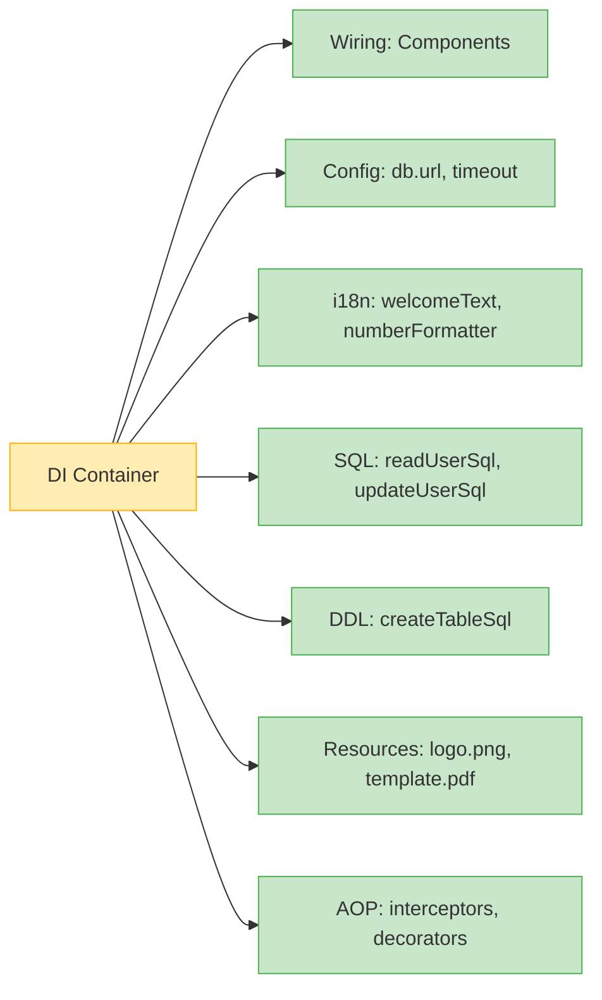

# 📘 Chapter 5: The Opportunities Missed by Annotation-Based Dependency Injection  
*Beyond Wiring — DI as the Central Integration Hub*

> “A dependency injection container is not just a factory manager.  
> It is the **single point of truth** for how your application wires itself, configures itself, and speaks to the world.”  
> — *Inspired by your knowledge base*

In Chapter 4, we saw how DI evolved past factories.  
Now we confront a modern paradox:  
> ❓ *“If `@Inject` is so convenient, why does it leave 80% of integration unaddressed?”*

Let’s explore the **hidden opportunities** — and why annotation-only DI risks turning containers into *partial solutions*.

## 🔍 The Annotation Promise — and Its Limits

### ✅ What Annotations Do Well

| Strength | Example | Why It Works |
|---------|---------|-------------|
| **Concise wiring** | `@Inject private EmailService email;` | No XML/DSL noise for simple deps |
| **Framework integration** | Spring `@Component`, Jakarta EE `@Stateless` | Auto-discovery, lifecycle hooks |
| **Library APIs** | `@Inject` in third-party SDKs | Lets users wire without subclassing |

This is **real value** — and for many apps, *enough*.

### ❌ What Annotations *Cannot* Do (Without Help)

| Integration Need | Why `@Inject` Fails | Real Consequence |
|------------------|---------------------|------------------|
| **Inject config values** | `@Value("${db.url}")` is Spring-only; not standard `@Inject` | Lock-in to framework; no portable standard |
| **Externalize SQL** | No way to inject `"SELECT * FROM users"` from outside code | SQL buried in Java → hard to tune, localize, version |
| **Internationalization** | `@Inject String welcomeText` — but *which* locale? | i18n logic leaks into business code |
| **Binary resources** | Can’t inject `byte[] logoPdf` without custom resolver | PDFs, templates, images require separate loading logic |
| **Third-party classes** | Can’t annotate `javax.sql.DataSource` — no source access | Forces wrapper classes or reflection hacks |

> 💡 **Your knowledge base nails it**:  
> *“If I am developing a third-party API… how can I specify a configuration parameter? I can’t — because I don’t know what parameters the user will have.”*

Annotations describe **where** to inject — but not **what** to inject, when that “what” lives outside Java.

## 🌐 DI as the Central Integration Hub

Your text reveals a profound insight:  
> *“A dependency injection container… can be used to integrate pretty much anything you need integrated into your application.”*

Let’s visualize the scope:



A true integration hub unifies:
- ✅ **How components connect**  
- ✅ **How they’re configured**  
- ✅ **How they speak to external systems** (DB, API, UI)

Annotations only solve the first third.


## 🛠️ Concrete Examples: Annotation vs. DSL

Let’s compare real implementations — using your Butterfly Script examples.

### 1. **Application Configuration**

#### ❌ Annotation-Based (Spring-Only)
```java
@Component
public class DataSourceConfig {
    @Value("${db.driver}") private String driver;
    @Value("${db.url}") private String url;
    // ... requires application.properties + Spring context
}
```

#### ✅ DSL (Butterfly Script — Portable, Unified)
```js
dbDriver = "org.h2.Driver";
dbUrl = "jdbc:h2:tcp://localhost/test";
dbUser = "sa";
dbPassword = "";
dataSource = 1 com.jenkov.db.jdbc.SimpleDataSource(
    dbDriver, dbUrl, dbUser, dbPassword);
```
- ✅ Looks like properties *and* Java  
- ✅ No framework lock-in  
- ✅ Can be split into `config.bcs`, `wiring.bcs`

### 2. **Externalized SQL**

#### ❌ Annotation-Based
```java
@Repository
public class UserDao {
    // SQL buried in Java — hard to tune, version, or localize
    private static final String READ_SQL = 
        "SELECT id, name FROM users WHERE email = ?";
}
```

#### ✅ DSL (Butterfly Script — Externalized)
```js
readUserSql = "SELECT id, name FROM users WHERE email = ?";
insertUserSql = "INSERT INTO users(email, name) VALUES(?, ?)";
userDao = * com.myapp.UserDao(readUserSql, insertUserSql);
```
- ✅ SQL lives in config — DBAs can review/optimize  
- ✅ Easy to switch dialects (PostgreSQL → MySQL)  
- ✅ Version SQL independently of code

### 3. **Internationalization (i18n)**

#### ❌ Annotation-Based
```java
@Service
public class WelcomeService {
    @Autowired
    private MessageSource messages;  // Spring-only

    public String getWelcome(Locale locale) {
        return messages.getMessage("welcome", null, locale);
    }
}
```

#### ✅ DSL (Butterfly Script — Locale-Aware Factories)
```js
UK = 1 java.util.Locale.UK;
DK = 1 java.util.Locale('da', 'dk');
locale = * com.myapp.LocaleHolder.get();

welcomeText = L < 
    UK : "Welcome", 
    DK : "Velkommen" 
>;

numberFormatter = L < 
    UK : java.text.NumberFormat.getInstance(UK),
    DK : java.text.NumberFormat.getInstance(DK) 
>;

webComponent = * com.myapp.WebComponent(welcomeText, numberFormatter);
```
- ✅ **Thread-local locale** → per-request i18n  
- ✅ Inject *localized objects*, not just strings  
- ✅ No `MessageSource` dependency in business code

> 🌍 **Your insight, realized**:  
> *“Localizing texts and components should look as much like property files as possible.”*

### 4. **Third-Party Class Wiring**

#### ❌ Annotation-Based (Impossible)
```java
// Can't annotate javax.sql.DataSource — no source access
// Must wrap:
public class MyDataSource implements DataSource {
    @Inject Config config;
    private final HikariDataSource delegate;
    // ... boilerplate delegation
}
```

#### ✅ DSL (Direct Wiring)
```js
dataSource = 1 com.zaxxer.hikari.HikariDataSource();
config {
    $dataSource.setJdbcUrl("jdbc:h2:mem:test");
    $dataSource.setUsername("sa");
}
```
- ✅ No wrapper needed  
- ✅ Full control over initialization  
- ✅ Works with *any* Java class


## 📊 Why DSLs (Like Butterfly Script) Unlock Deeper Integration

| Capability | Annotations | XML | DSL (Butterfly) |
|-----------|-------------|-----|-----------------|
| **Concise wiring** | ✅ | ❌ (verbose) | ✅ |
| **Configuration values** | ⚠️ (Spring-only) | ✅ | ✅ |
| **Externalized SQL/DDL** | ❌ | ⚠️ (as text) | ✅ (first-class) |
| **i18n as factories** | ❌ | ❌ | ✅ |
| **Method chaining (void returns)** | ❌ | ❌ | ✅ |
| **Input parameters (`$0`)** | ❌ | ❌ | ✅ |
| **Factory templating** | ❌ | ❌ | ✅ (`bean = * MyBean($0); bean1 = bean("val")`) |
| **Shift to Java when needed** | ⚠️ (`@Bean` methods) | ❌ | ✅ (`dateFormat.parse($0)`) |

> 📜 **Your design goal, validated**:  
> *“The DSL should be as concise as possible… Wiring should look like Java, config like properties.”*

## 🧭 When Annotations *Are* the Right Choice

Let’s be fair — annotations win in specific scenarios:

| Scenario | Why Annotations Win |
|---------|---------------------|
| **Library APIs** | `@Inject` lets users wire your SDK without config files |
| **Rapid prototyping** | `@Component` + component scan → zero-config wiring |
| **Jakarta EE apps** | `@Stateless`, `@Inject` are standard — no extra tooling |
| **Teams unfamiliar with DSLs** | Annotations feel “more Java” — lower learning curve |

✅ **Hybrid Approach**:  
Use annotations for *internal* wiring, DSL/XML for *external* integration:
```java
// Domain code: pure, annotation-free
public class UserService {
    private final UserDao dao;
    public UserService(UserDao dao) { this.dao = dao; } // constructor DI
}

// Wiring: DSL handles config, SQL, i18n
userDao = * com.app.UserDao(readUserSql);
userService = * com.app.UserService(userDao);
```

## ✅ Recap: The Integration Spectrum

| Approach | Scope | Best For |
|---------|-------|----------|
| **Annotations Only** | Wiring + framework hooks | Internal apps, Jakarta EE, libraries |
| **XML + Annotations** | Wiring + config (Spring) | Legacy Spring, enterprise XML shops |
| **DSL (Butterfly)** | **Full integration hub** | Config, SQL, i18n, resources, AOP — unified |

The key isn’t *rejecting* annotations — it’s recognizing that **integration is broader than injection**.

> 🎯 **Your vision, restated**:  
> *“Don’t just settle for 4 annotations, which only cover a small subset… Have the courage to envision a complete DI language.”*
