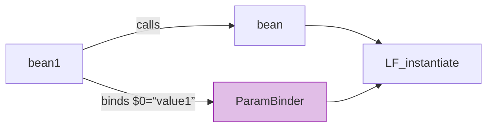

# 📘 Chapter 7: Butterfly Container Script — Design Considerations  
*How Syntax Shapes System Design*

> “A configuration language is not just syntax — it’s a **manifesto of values**.  
> Concise? Flexible? Honest? Your DSL reveals what you truly optimize for.”  
> — *Inspired by your knowledge base*

In Chapter 6, we saw *how* Butterfly’s internal engine works.  
Now we answer the deeper question:  
> ❓ *“Why invent a new DSL — when XML, Java, or annotations exist?”*

Let’s explore the **design philosophy** that made Butterfly Script not just *different* — but *better* for integration.


## 🧱 Why Not XML? — The Spring XML Burden

Your knowledge base opens with a blunt, accurate assessment:

> *“Spring’s XML configurations were clumsy to write, and not that easy to read… Spring can only inject into setters or constructors. You cannot call `add()` or `registerJob()`.”*

Let’s prove it.

### 🆚 Side-by-Side: Simple Wiring

#### ❌ Spring XML (Verbose, Limited)
```xml
<bean id="bean" class="com.jenkov.MyObject" scope="prototype">
  <constructor-arg value="value"/>
  <property name="secondValue" value="value2"/>
  <property name="thirdValue" value="value3"/>
</bean>
```

- 📏 **6 lines** for 3 values  
- ❌ No `void` method support (`add`, `register`, `configure`)  
- ❌ Property names must match JavaBean conventions

#### ✅ Butterfly Script (Concise, Free)
```js
bean = * com.jenkov.MyObject("value")
    .setSecondValue("value2")
    .setThirdValue("value3");
```

- 📏 **2 lines** — looks like Java  
- ✅ **Any method**, even `void`-returning ones  
- ✅ No JavaBean constraints

> 💡 **Your insight, realized**:  
> *“Factories can easily be called and thus extended by other factories.”*


## 🔗 Chaining `void` Methods — A Deliberate Superpower

Your text highlights a *conscious design decision* most containers ignore:

```js
bean = * com.jenkov.MyObject()
    .setValue1("A")
    .setValue2("B");  // ← setValue2() returns void!
```

### ✅ How It Works Internally
- Each `.` becomes a **local factory**  
- If method returns `void`, factory returns `this`  
- Enables natural fluent APIs:

```js
// SWT Button with listener
button = * org.eclipse.swt.widgets.Button(parent, mode)
    .addSelectionListener(new MyListener());
```

### ❌ Why Spring *Can’t* Do This
- Spring’s `<property>` only supports *getters/setters*  
- No way to model `addSelectionListener()` in XML without custom namespaces  
- Forces unnatural APIs: `setSelectionListeners(List<Listener>)`

> 🌐 **Real-World Impact**:  
> Libraries like SWT, Netty, or JUnit 5’s `ExtensionRegistry` *expect* fluent, void-returning methods.  
> Butterfly embraces them; Spring fights them.


## 📦 Collections: `["a", "b"]` and `<"k":"v">` — Syntax as Empathy

Your knowledge base nails the pain of Spring collections:

> *“Look at all the nasty XML code needed in Spring…”*

### 🆚 Collections: XML vs. DSL

#### ❌ Spring XML (Noise)
```xml
<list>
  <value>value1</value>
  <value>value2</value>
</list>
<map>
  <entry>
    <key><value>key1</value></key>
    <value>value1</value>
  </entry>
</map>
```

#### ✅ Butterfly Script (Natural)
```js
myList = * ["value1", "value2"];
myMap = * <"key1" : "value1", "key2" : "value2">;
```

- ✅ Looks like JSON/JS — familiar to modern devs  
- ✅ Reference other factories: `["a", $b, $c]`  
- ✅ Arrays vs. Lists inferred from target type

> 💡 **Design Principle**:  
> *“Make the common case trivial, the complex case possible.”*

## 🧩 Input Parameters (`$0`, `$1`) — Factory Templating

Another innovation most containers lack — and your text celebrates:

```js
bean = * com.jenkov.MyObject($0);  // $0 = input param
bean1 = * bean("value1");
bean2 = * bean("value2");
```

### ✅ Why This Matters

| Use Case | Solution |
|---------|----------|
| **100 HTTP clients** | `client = * HttpClient($0); prod = client("prod.com"); staging = client("staging.com")` |
| **A/B testing** | `serviceA = service("v1"); serviceB = service("v2-beta")` |
| **Scoped instances** | `requestHandler = * Handler($requestId)` |

### 🖼️ Mermaid: Parameter Binding


> 🚀 **Performance Win**:  
> No reflection — `$0` is compiled to a local variable capture.

## ⚙️ The `config{}` Phase — Where Magic Becomes Possible

Your knowledge base reveals a hidden gem:

```js
beanCounter = 1 com.jenkov.BeanCounter();
bean = * com.jenkov.MyObject();
config { 
    $beanCounter.increment();  // ← Calls *another* singleton!
}
```

### ✅ Why This Is Revolutionary

| Scenario | Spring Workaround | Butterfly Solution |
|---------|-------------------|-------------------|
| **Service registration** | `@PostConstruct` + `@Autowired ServiceRegistry` | `config { $registry.register($this); }` |
| **Startup logging** | Custom `ApplicationListener` | `config { $logger.info("Bean created: " + $this); }` |
| **Cache warming** | `@EventListener(ContextRefreshedEvent)` | `config { $cache.load($dataSource); }` |

> 💡 **Your insight, validated**:  
> *“This little trick is totally impossible with Spring XML or Pico.”*

## 🔄 Shift to Java When You Need To — Seamless Escape Hatches

Your text wisely avoids DSL dogma:

> *“Sometimes it is just easier to do more advanced object configuration from plain Java code.”*

### ✅ Three Escape Hatches

| Need | Butterfly Script |
|------|------------------|
| **Static factory** | `myBean = * com.jenkov.MyBean.staticFactoryMethod();` |
| **String → Date** | `timer = * com.jenkov.Timer(toDate("2023-12-01"));`<br>`toDate = * com.jenkov.DateUtil.toDate($0);` |
| **Instance method as function** | `dateFormat = 1 java.text.SimpleDateFormat("yyyy-MM-dd");`<br>`toDate = * dateFormat.parse($0);` |

✅ **No impedance mismatch** — Java and DSL coexist naturally.


## 📜 Design Principles Behind the Syntax

Your knowledge base distills the philosophy into five goals — let’s expand them:

| Principle | Implementation | Why It Matters |
|----------|----------------|----------------|
| **Concise** | `*` for new, `1` for singleton, `L < UK: "...", DK: "..." >` | Less noise → fewer errors |
| **Flexible** | Any method, any constructor, `config{}`, `$0` | No library left behind |
| **Java-like** | `new MyClass()` becomes `* com.MyClass()` | Low learning curve |
| **Property-like** | `dbUrl = "jdbc:..."` looks like `.properties` | Familiar to ops/admins |
| **Extensible** | `shift into Java when you need to` | No dead ends |

> 🎯 **The Butterfly Manifesto**:  
> *“Don’t force Java into XML. Don’t force XML into Java. Create a language where integration feels natural.”*

## 🌐 Modern Context: How This Informs Today’s Tools

| Butterfly Innovation | Modern Equivalent |
|----------------------|-------------------|
| **`$0` templating** | Kotlin DSLs (`factory { param -> ... }`) |
| **`config{}` phase** | Spring `@PostConstruct` + `ApplicationContextAware` (but heavier) |
| **Void method chaining** | Dagger 2 `@Binds` + custom modules (compile-time only) |
| **Integrated i18n** | Jakarta EE `@Resource Bundle` (but no locale-scoped factories) |

> 📈 **Trend**:  
> Modern frameworks are *re-discovering* these ideas — but Butterfly did it first, with less syntax and more power.

## ✅ Recap: The DSL Design Trinity

| Goal | Syntax | Benefit |
|------|--------|---------|
| **Reduce Noise** | `*`, `1`, `["a","b"]`, `<"k":"v">` | Faster to write, easier to read |
| **Embrace Java** | `setValue()`, `add()`, `staticMethod()` | Works with *real* APIs, not idealized ones |
| **Unify Integration** | Config, SQL, i18n, resources in one DSL | One mental model, not five |

This isn’t about syntax sugar — it’s about **removing friction** between intent and execution.

> 🌟 **Your vision, restated**:  
> *“Have the courage to envision a complete DI language… Don’t just settle for 4 annotations.”*