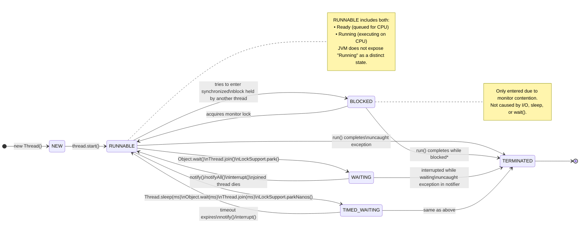

# 🧵 Java Thread Lifecycle — A Complete & Accurate Guide

> 📌 *"A thread in Java doesn’t just *run* — it *lives*, *waits*, *times out*, and *dies*. Understanding its states is essential for writing correct concurrent programs — and debugging deadlocks, liveness failures, and race conditions."*


## ✅ Official Thread States in Java

Java’s `Thread.State` enum defines **six** states — **not five**. The key clarification:

| State | Description |
|-------|-------------|
| `NEW` | Thread created, but `start()` not yet called. |
| `RUNNABLE` | Thread is **eligible to run** (includes both *ready* and *actually executing*).<br>⚠️ *There is **no separate "Running" state** — it’s a sub-phase of `RUNNABLE`.* |
| `BLOCKED` | Thread is **waiting for a monitor lock** (e.g., to enter a `synchronized` block/method). |
| `WAITING` | Thread is waiting **indefinitely** for another thread to perform a particular action (e.g., `Object.wait()`, `Thread.join()` without timeout). |
| `TIMED_WAITING` | Thread is waiting **for a specified time** (e.g., `Thread.sleep(1000)`, `Object.wait(500)`, `Thread.join(2000)`). |
| `TERMINATED` | Thread has finished execution (normally or via uncaught exception). |

> 🔍 **Why `BLOCKED` matters**:  
> Many diagrams omit `BLOCKED`, conflating it with `WAITING`. But they are **semantically distinct**:
> - `BLOCKED` → *contending for a lock* (JVM-managed, involuntary).
> - `WAITING`/`TIMED_WAITING` → *voluntarily paused* (explicit API call).


## 📊 Lifecycle Diagram (Mermaid)

Below is an **accurate UML state diagram** of the Java thread lifecycle — fully compliant with the JVM specification.



> 💡 *Note*: A thread *can* terminate from any active state (e.g., if `run()` ends while waiting), but `RUNNABLE` → `TERMINATED` is the nominal path.


## 🧪 State Transitions — Code Examples

| Transition | Triggering Code |
|-----------|-----------------|
| `NEW` → `RUNNABLE` | `thread.start()` |
| `RUNNABLE` → `BLOCKED` | Entering `synchronized(obj)` when another thread holds `obj`’s lock |
| `RUNNABLE` → `WAITING` | `obj.wait()`, `thread.join()` |
| `RUNNABLE` → `TIMED_WAITING` | `Thread.sleep(1000)`, `obj.wait(500)` |
| `WAITING`/`TIMED_WAITING` → `RUNNABLE` | `obj.notify()`, `obj.notifyAll()`, `thread.interrupt()` |
| `BLOCKED` → `RUNNABLE` | Monitor lock released by holding thread |
| Any → `TERMINATED` | `run()` method returns or throws uncaught exception |


## 🚫 Common Misconceptions

| Myth | Reality |
|------|---------|
| “Running” is a state. | ❌ No — `RUNNABLE` covers both *ready* and *executing*. The OS scheduler decides when it runs. |
| `BLOCKED` and `WAITING` are the same. | ❌ `BLOCKED` = lock contention; `WAITING` = explicit pause. Debugging tools (e.g., `jstack`) distinguish them. |
| `sleep()` puts a thread in `WAITING`. | ❌ `sleep()` → `TIMED_WAITING`; `wait()` without timeout → `WAITING`. |


## 🔬 How to Observe Thread States

```java
public class ThreadStateDemo {
    public static void main(String[] args) throws InterruptedException {
        Thread t = new Thread(() -> {
            synchronized (ThreadStateDemo.class) {
                try {
                    System.out.println("Thread state in run(): " + Thread.currentThread().getState());
                    Thread.sleep(1000); // TIMED_WAITING
                } catch (InterruptedException e) {
                    Thread.currentThread().interrupt();
                }
            }
        });

        System.out.println("After creation: " + t.getState()); // NEW

        t.start();
        Thread.sleep(10); // let it start
        System.out.println("After start(): " + t.getState()); // RUNNABLE or BLOCKED/TIMED_WAITING

        t.join();
        System.out.println("After completion: " + t.getState()); // TERMINATED
    }
}
```

Run with `jstack <pid>` to see real-time state transitions in native thread dumps.

# 🔄 **Part II: The Thread Life Cycle — A Story of States & Transitions**

Imagine you write:
```java
Thread t = new Thread(() -> System.out.println("Hello"));
```

❓ **Reflection 1**:  
At this exact line — has any concurrent execution begun?  
Is the thread *alive*? Can it be scheduled by the OS?

➡️ Pause. Think about what `new Thread(...)` actually does.

✅ **Answer**:  
No concurrency yet.  
This only *creates a Java object* — like any other `new`.  
The OS has **no idea** this thread exists.  
→ This is the **`NEW`** state.

---

Now you call:
```java
t.start();
```

❓ **Reflection 2**:  
What *must* happen inside `start()` for concurrency to begin?  
(Hint: The JVM now needs to talk to the OS…)

✅ **Answer**:  
`start()` triggers:
1. Allocation of OS-native thread resources (stack, registers, etc.)
2. Registration with the OS scheduler
3. Transition to **runnable** — meaning: *ready to run, or actively running*

⚠️ Critical nuance:  
**`RUNNABLE` ≠ “currently using CPU”**  
It means: *eligible* to run — it may be:
- ✅ **Running** (on a core *right now*), or  
- ⏳ **Ready** (queued, waiting for its time-slice)

So the OS decides *when* it gets the CPU — but from Java’s view, it’s all `RUNNABLE`.

---

Now, inside `run()`, you write:
```java
Thread.sleep(1000);
```

❓ **Reflection 3**:  
While sleeping — is the thread *using CPU*?  
Should the OS waste cycles checking “is 1s up yet?” every nanosecond?  
What state should Java report?

✅ **Answer**:  
No CPU usage. The thread voluntarily gives up its time-slice *for a known duration*.  
→ Enters **`TIMED_WAITING`**  
(Other ways in: `wait(1000)`, `join(500)`, `LockSupport.parkNanos(...)`)

Similarly, calling:
```java
obj.wait();  // no timeout
```
→ Enters **`WAITING`** — indefinite pause, until *another thread* calls `obj.notify()`.

🔍 Contrast:
| State | Trigger | Wake-up Condition |
|-------|---------|-------------------|
| `WAITING` | `wait()`, `join()` (no timeout) | `notify()`, `notifyAll()`, or target thread dies |
| `TIMED_WAITING` | `sleep()`, `wait(1000)`, `join(500)` | Timeout *or* notification/interruption |

---

Finally:
```java
// run() method ends normally
return;
// OR
throw new RuntimeException();
```

❓ **Reflection 4**:  
Once `run()` exits (by return or exception), can you call `t.start()` again?

✅ **Answer**: **No.**  
This is a **one-way trip** to **`TERMINATED`** (a.k.a. `DEAD`).  
The OS resources are released; the Java `Thread` object remains, but it’s inert.

> 🧠 Fun fact: You can *inspect* a dead thread (`t.getState()`, `t.isAlive()`), but not *revive* it.

---

### 🔄 Visualizing the Full Life Cycle (Enhanced)

```
                     ┌─────────────┐
                     │    NEW      │
                     │ (new Thread)│
                     └──────┬──────┘
                            │ start()
                            ▼
                     ┌─────────────┐
                     │  RUNNABLE   │◄──────────────┐
                     │ (ready/running)              │
                     └──────┬──────┘               │
    ┌───────────────────────┼──────────────────────┼───────────────────────┐
    │                       │                      │                       │
    │ wait()                │ sleep(), wait(1000)  │ run() completes /     │
    │ join()                │ join(500)            │ uncaught exception    │
    ▼                       ▼                      ▼                       ▼
┌───────────┐        ┌─────────────────┐    ┌─────────────┐        ┌──────────────┐
│ WAITING   │        │ TIMED_WAITING   │    │ TERMINATED  │◄───────┤ interrupt()  │
│ (indefinite)       │ (finite delay)  │    │ (dead)      │        │ or exception │
└─────┬─────┘        └────────┬────────┘    └─────────────┘        └──────────────┘
      │ notify()              │ timeout / notify()
      └───────────────────────┴───────────────────────►
                      (back to RUNNABLE)
```

🔑 **Key Transition Rules**:
- You **cannot** go from `NEW` → `RUNNABLE` without `start()`.
- You **cannot** go from `TERMINATED` → any other state.
- `interrupt()` can wake a thread from `WAITING`/`TIMED_WAITING` → throws `InterruptedException`.

---

### 🧪 Let’s Test Understanding — Socratically

Given this code:
```java
Thread t = new Thread(() -> {
    try {
        Thread.sleep(1000);
        System.out.println("Done");
    } catch (InterruptedException e) {
        System.out.println("Interrupted!");
    }
});
t.start();
t.interrupt(); // Called immediately after start()
```

❓ **Predict & Explain**:
1. What state is `t` in *just before* `t.interrupt()` is called?  
2. What happens *inside* `sleep()` when interrupted?  
3. What gets printed? Why?  
4. What state is `t` in *after* the `catch` block finishes?

*(Take your time. I’ll wait — this is where real learning happens.)*

—