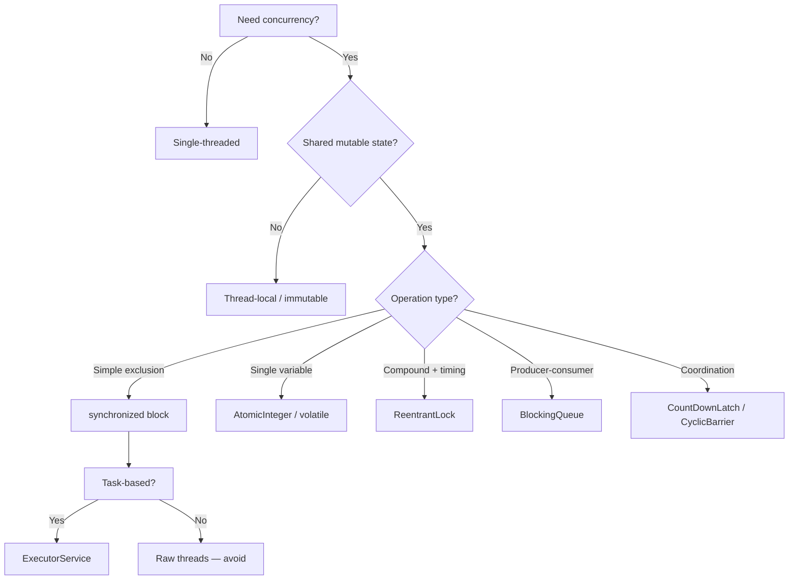

# 🧩 **Java Multithreading & Synchronization: The Complete Mental Model**

## 🔑 **Core Principle**  
> **Concurrency bugs are not logic bugs — they’re *timing* and *visibility* bugs.**  
> Synchronization solves three problems:  
> 1. **Mutual Exclusion** — only one thread in a critical section  
> 2. **Visibility** — changes made by one thread are seen by others  
> 3. **Atomicity** — compound operations appear indivisible  

## 🌐 **1. Thread Lifecycle & Control**

### Thread States (5)
```java
NEW → RUNNABLE → (WAITING / TIMED_WAITING) → TERMINATED
```
- `NEW`: After `new Thread()`  
- `RUNNABLE`: After `start()` — ready or running  
- `WAITING`: `wait()`, `join()` (indefinite)  
- `TIMED_WAITING`: `sleep()`, `wait(1000)`  
- `TERMINATED`: `run()` exited

### Key Control Methods
| Method | Acts On | Purpose |
|-------|---------|---------|
| `t.start()` | `t` | Begin execution (✅ only once!) |
| `t.interrupt()` | `t` | Set interrupt flag — *cooperative* cancellation |
| `t.join()` | Calling thread | Wait for `t` to finish |
| `Thread.sleep(m)` | Current thread | Pause (releases CPU, *not* locks) |
| `Thread.yield()` | Current thread | Hint: “Let same-priority threads run” |

### ✅ **Interruption Protocol (Cooperative Cancellation)**
```java
// In worker thread:
while (!Thread.currentThread().isInterrupted()) {
    doWork();
    try { Thread.sleep(100); } 
    catch (InterruptedException e) {
        Thread.currentThread().interrupt(); // 🔑 Restore flag
        return; // Exit cleanly
    }
}
```

> 🚫 **Never use**: `suspend()`, `resume()`, `stop()` — deprecated since Java 1.2.

---

## 🔐 **2. Synchronization: Protecting Shared State**

### When Is Sync Needed?
✅ **Only when**:  
- Multiple threads access **shared**, **mutable** state  
- At least one access is a **write**

🚫 **Not needed for**:  
- Immutable data (`final`, `String`, `LocalDate`)  
- Thread-confined data (only one thread accesses it)  
- Thread-safe collections (`ConcurrentHashMap`, `CopyOnWriteArrayList`)

## A. **Intrinsic Locks (`synchronized`)**

#### Block-Level (Recommended)
```java
private final Object lock = new Object(); // ✅ Private, final

void update() {
    synchronized (lock) { // 🔑 Lock on private object
        // Critical section: read-modify-write
        count++;
    }
}
```

#### Method-Level (Convenience — use cautiously)
```java
public synchronized void update() { ... }        // Locks on 'this'
public static synchronized void update() { ... } // Locks on MyClass.class
```

#### ✅ Key Properties
- **Reentrant**: same thread can re-acquire  
- **Automatic release**: even on exception  
- **Happens-before**: ensures visibility

## B. **Explicit Locks (`ReentrantLock`)**

#### When to Use
- Need **fairness** (`new ReentrantLock(true)`)  
- Need **timeout** (`tryLock(1, SECONDS)`)  
- Need **interruptible acquire** (`lockInterruptibly()`)  
- Need **multiple conditions** (`newCondition()`)

#### Safe Usage Pattern
```java
private final ReentrantLock lock = new ReentrantLock();

void update() {
    lock.lock(); // Blocks until acquired
    try {
        count++;
    } finally {
        lock.unlock(); // ✅ Must be in finally
    }
}
```

#### ❌ Dangerous Anti-Pattern
```java
if (lock.tryLock()) {
    lock.lock();   // ❌ Double-lock → leaked lock
    ...
    lock.unlock(); // Only decrements hold count — not fully released!
}
```

## C. **Lock-Free Synchronization**

#### Atomic Variables (Best for counters, flags)
```java
private final AtomicInteger count = new AtomicInteger();

void increment() {
    count.incrementAndGet(); // ✅ Lock-free, atomic, visible
}
```

#### Volatile (For single-variable visibility)
```java
private volatile boolean ready = false; // ✅ Writes visible to all threads

// Thread-1
data = 42;
ready = true; // Happens-before: data write → ready write

// Thread-2
if (ready) {
    System.out.println(data); // ✅ Always sees 42
}
```

> 🔑 **Rule**: `volatile` ≠ atomic. Use for flags or *single* writes — not `i++`.

---

## 📡 **3. Inter-Thread Communication**

### `wait()` / `notify()` — Low-Level Coordination

#### Safe Pattern (✅ Always use `while` + `notifyAll()`)
```java
private final Object lock = new Object();
private boolean dataReady = false;

void produce(Item item) {
    synchronized (lock) {
        queue.add(item);
        dataReady = true;
        lock.notifyAll(); // ✅ Wake all waiters
    }
}

Item consume() throws InterruptedException {
    synchronized (lock) {
        while (!dataReady) { // ✅ while, not if!
            lock.wait();     // Releases lock, waits
        }
        dataReady = false;
        return queue.remove();
    }
}
```

### Modern Alternatives (✅ Prefer these)
| Need | Tool |
|------|------|
| Producer-consumer | `BlockingQueue` (`ArrayBlockingQueue`, `LinkedBlockingQueue`) |
| One-time signal | `CountDownLatch` |
| Barrier (N threads wait) | `CyclicBarrier` |
| Async signaling | `CompletableFuture` |

#### Example: `BlockingQueue` (No sync needed!)
```java
BlockingQueue<Item> queue = new ArrayBlockingQueue<>(10);

// Producer
queue.put(item); // Blocks if full

// Consumer
Item item = queue.take(); // Blocks if empty
```

---

## 🏊‍♂️ **4. Thread Pools & Task-Based Concurrency**

### Why Pools?
- ✅ Lower latency (reuse threads)  
- ✅ Resource control (cap threads)  
- ✅ Automatic cleanup

### Built-in Executors
| Pool | Use Case |
|------|----------|
| `newFixedThreadPool(n)` | CPU-bound, steady load |
| `newCachedThreadPool()` | I/O bursts, short tasks |
| `newSingleThreadExecutor()` | Sequential execution (logs, events) |
| `newScheduledThreadPool(n)` | Timers, periodic tasks |

#### Safe Pattern
```java
ExecutorService pool = Executors.newFixedThreadPool(4);

// Submit tasks
Future<String> future = pool.submit(() -> compute());

// Shutdown gracefully
pool.shutdown();
if (!pool.awaitTermination(30, SECONDS)) {
    pool.shutdownNow();
}
```

### 🚀 **Virtual Threads (Java 21+)**
```java
try (var executor = Executors.newVirtualThreadPerTaskExecutor()) {
    IntStream.range(0, 10_000).forEach(i -> 
        executor.submit(() -> {
            Thread.sleep(1000); // Blocks virtual thread, not OS thread!
            return i;
        })
    );
} // Auto-shutdown
```

✅ Millions of tasks, no tuning, same `ExecutorService` API.

---

## ⚠️ **5. Common Pitfalls & Fixes**

| Pitfall | Symptom | Fix |
|--------|---------|-----|
| **Race condition** | Intermittent wrong results | Sync all shared mutable state |
| **Visibility failure** | Stale reads | Use `synchronized`, `volatile`, or `final` |
| **Deadlock** | App freezes | Avoid nested locks; use lock ordering |
| **Starvation** | Thread never runs | Use fair locks (`ReentrantLock(true)`) or `CallerRunsPolicy` |
| **Leaked lock** | Thread blocks forever | Always `unlock()` in `finally` |
| **Ignoring `InterruptedException`** | Thread can’t be canceled | Restore flag or exit |

---

## 🧭 **6. Decision Flowchart: Which Tool to Use?**



## ✅ **Golden Rules of Java Concurrency**

1. **Design for correctness first** — optimize only after profiling.  
2. **Synchronize *all* accesses** (reads *and* writes) to shared mutable state.  
3. **Prefer immutable or thread-confined data** over synchronization.  
4. **Use high-level utilities** (`java.util.concurrent`) over low-level `wait()`/`notify()`.  
5. **Never use deprecated methods** (`stop()`, `suspend()`, `resume()`).  
6. **Interruption is cooperative** — always check and respond.  
7. **Lock on the scope of the data**:  
   - Instance field → instance lock  
   - Static field → class lock  
   - Global state → private static lock