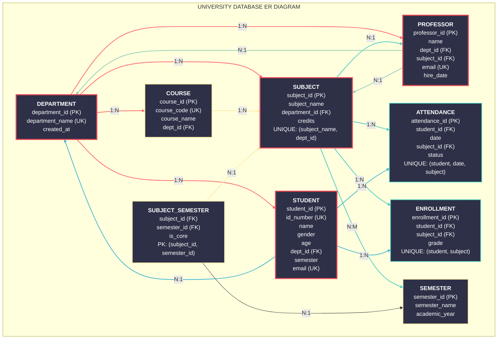

# 🎓 University Database Schema Documentation

## 📋 Overview

This document describes the **University Database Schema** - a relational database designed to manage university operations including student information, faculty details, course management, and attendance tracking. The schema follows normalization principles and maintains referential integrity through well-defined relationships.

## 🏗️ Database Architecture

### 📊 Schema Overview

The database consists of **5 core tables** that form the foundation of university operations:



## 📋 Table Details & Relationships

### 1. **Department Table** 🏛️
**Purpose**: Stores information about academic departments (CSE, IT, ECE, Mechanical, etc.)

| Column | Type | Description | Constraints |
|--------|------|-------------|-------------|
| `department_id` | INT | Unique identifier for each department | **PRIMARY KEY**, Auto Increment |
| `department_name` | VARCHAR(100) | Name of the department | **UNIQUE**, NOT NULL |
| `created_at` | TIMESTAMP | When the record was created | DEFAULT CURRENT_TIMESTAMP |

**Role in Database**: Central table that organizes academic structure. All students, professors, and subjects are linked to departments.

---

### 2. **Subject Table** 📚
**Purpose**: Contains all academic subjects/courses offered by the university

| Column | Type | Description | Constraints |
|--------|------|-------------|-------------|
| `subject_id` | INT | Unique identifier for each subject | **PRIMARY KEY**, Auto Increment |
| `subject_name` | VARCHAR(100) | Name of the subject/course | NOT NULL |
| `department_id` | INT | Department offering this subject | **FOREIGN KEY** → Department(department_id) |
| `credits` | INT | Credit value of the subject | DEFAULT 3 |

**Relationships**:
- **Belongs to**: One Department (Many subjects can belong to one department)
- **Has**: Many Attendance records

---

### 3. **Student Table** 👨‍🎓
**Purpose**: Comprehensive student information management

| Column | Type | Description | Constraints |
|--------|------|-------------|-------------|
| `student_id` | INT | Unique student identifier | **PRIMARY KEY**, Auto Increment |
| `id_number` | VARCHAR(20) | University ID number | **UNIQUE**, NOT NULL |
| `enrollment_id` | VARCHAR(20) | Enrollment number | **UNIQUE** |
| `name` | VARCHAR(100) | Full name of student | NOT NULL |
| `age` | INT | Age of student | CHECK (16-70) |
| `date_of_birth` | DATE | Student's birth date | |
| `gender` | ENUM | Gender identification | 'Male', 'Female', 'Other' |
| `course_id` | INT | Current course reference | **FOREIGN KEY** (reserved for future use) |
| `semester` | INT | Current semester | DEFAULT 1 |
| `academic_year` | VARCHAR(10) | Academic year | e.g., "2024-2025" |
| `state` | VARCHAR(50) | State of residence | |
| `city` | VARCHAR(50) | City of residence | |
| `country` | VARCHAR(50) | Country | DEFAULT 'India' |
| `phone_number` | VARCHAR(15) | Contact number | |
| `email` | VARCHAR(100) | Email address | **UNIQUE** |
| `enrollment_date` | DATE | Date of enrollment | |
| `department_id` | INT | Department of study | **FOREIGN KEY** → Department(department_id) |

**Relationships**:
- **Belongs to**: One Department (Each student belongs to one department)
- **Has**: Many Attendance records

---

### 4. **Professor Table** 👨‍🏫
**Purpose**: Faculty information and department assignments

| Column | Type | Description | Constraints |
|--------|------|-------------|-------------|
| `professor_id` | INT | Unique faculty identifier | **PRIMARY KEY**, Auto Increment |
| `name` | VARCHAR(100) | Full name of professor | NOT NULL |
| `department_id` | INT | Department affiliation | **FOREIGN KEY** → Department(department_id) |
| `subject_id` | INT | Primary subject taught | **FOREIGN KEY** → Subject(subject_id) |
| `email` | VARCHAR(100) | Email address | **UNIQUE** |
| `phone_number` | VARCHAR(15) | Contact number | |
| `hire_date` | DATE | Date of joining | |

**Relationships**:
- **Belongs to**: One Department (Each professor works in one department)
- **Teaches**: One or more Subjects (Currently linked to one primary subject)

---

### 5. **Attendance Table** ✅
**Purpose**: Daily attendance tracking for students

| Column | Type | Description | Constraints |
|--------|------|-------------|-------------|
| `attendance_id` | INT | Unique attendance record | **PRIMARY KEY**, Auto Increment |
| `student_id` | INT | Student reference | **FOREIGN KEY** → Student(student_id) |
| `date` | DATE | Date of attendance | NOT NULL |
| `subject_id` | INT | Subject reference | **FOREIGN KEY** → Subject(subject_id) |
| `status` | ENUM | Attendance status | 'Present', 'Absent', 'Late', 'Excused' |
| `recorded_at` | TIMESTAMP | When record was created | DEFAULT CURRENT_TIMESTAMP |

**Key Constraint**: `UNIQUE(student_id, date, subject_id)` - Prevents duplicate attendance for same student, date, and subject

**Relationships**:
- **Belongs to**: One Student (Many attendance records for one student)
- **Belongs to**: One Subject (Many attendance records for one subject)

## 🔗 Relationship Map

### Primary Relationships:

1. **Department ↔ Student** (1:N)
   - One department can have many students
   - Each student belongs to exactly one department
   ```sql
   ALTER TABLE Student
   ADD FOREIGN KEY (department_id) 
   REFERENCES Department(department_id);
   ```

2. **Department ↔ Professor** (1:N)
   - One department can have many professors
   - Each professor works in exactly one department
   ```sql
   ALTER TABLE Professor
   ADD FOREIGN KEY (department_id) 
   REFERENCES Department(department_id);
   ```

3. **Department ↔ Subject** (1:N)
   - One department offers many subjects
   - Each subject belongs to exactly one department
   ```sql
   ALTER TABLE Subject
   ADD FOREIGN KEY (department_id) 
   REFERENCES Department(department_id);
   ```

4. **Student ↔ Attendance** (1:N)
   - One student can have many attendance records
   - Each attendance record is for exactly one student
   ```sql
   ALTER TABLE Attendance
   ADD FOREIGN KEY (student_id) 
   REFERENCES Student(student_id);
   ```

5. **Subject ↔ Attendance** (1:N)
   - One subject can have many attendance records
   - Each attendance record is for exactly one subject
   ```sql
   ALTER TABLE Attendance
   ADD FOREIGN KEY (subject_id) 
   REFERENCES Subject(subject_id);
   ```

6. **Professor ↔ Subject** (N:1 via subject_id)
   - Many professors can teach the same subject
   - Each professor has one primary subject
   ```sql
   ALTER TABLE Professor
   ADD FOREIGN KEY (subject_id) 
   REFERENCES Subject(subject_id);
   ```

## 📊 Data Flow Diagram

```bash
┌─────────────┐     ┌─────────────┐      ┌─────────────┐
│             │     │             │      │             │
│  DEPARTMENT │────▶│   SUBJECT   │◀────│  PROFESSOR  │
│             │     │             │      │             │
└──────┬──────┘     └──────┬──────┘      └─────────────┘
       │                   │
       ▼                   ▼
┌─────────────┐     ┌─────────────┐
│             │     │             │
│   STUDENT   │────▶│ ATTENDANCE  │
│             │     │             │
└─────────────┘     └─────────────┘
```


```bash
┌───────────────────────────────────────────────────────────────────────────────────┐
│                          UNIVERSITY DATABASE ER DIAGRAM                           │
├───────────────────────────────────────────────────────────────────────────────────┤
│                                                                                   │
│  DEPARTMENT (1)                                                                   │
│  ├─ department_id (PK)           ┌──────────────────────────────────────────┐     │
│  ├─ department_name (UK)         │       RELATIONSHIPS                      │     │  
│  └─ created_at                   │  DEPARTMENT 1───N SUBJECT                │     │  
│                                  │  DEPARTMENT 1───N STUDENT                │     │  
│  SUBJECT (N)                     │  DEPARTMENT 1───N PROFESSOR              │     │  
│  ├─ subject_id (PK)              │  DEPARTMENT 1───N COURSE                 │     │  
│  ├─ subject_name                 │  SUBJECT N───1 PROFESSOR                 │     │  
│  ├─ department_id (FK) → DEPT    │  SUBJECT 1───N ATTENDANCE                │     │  
│  ├─ credits                      │  SUBJECT 1───N ENROLLMENT                │     │  
│  └─ UNIQUE(subject_name, dept_id)│  SUBJECT N───M SEMESTER (via junction)   │     │  
│                                  │  STUDENT N───1 DEPARTMENT                │     │  
│  STUDENT (N)                     │  STUDENT 1───N ATTENDANCE                │     │  
│  ├─ student_id (PK)              │  STUDENT 1───N ENROLLMENT                │     │  
│  ├─ id_number (UK)               │  PROFESSOR N───1 DEPARTMENT              │     │  
│  ├─ name                         │  PROFESSOR N───1 SUBJECT                 │     │
│  ├─ gender                       └──────────────────────────────────────────┘     │
│  ├─ age                                                                           │   
│  ├─ department_id (FK) → DEPT                                                     │   
│  ├─ semester                                                                      │   
│  ├─ email (UK)                                                                    │   
│  └─ enrollment_date                                                               │   
│                                                                                   │   
│  PROFESSOR (N)                                                                    │   
│  ├─ professor_id (PK)                                                             │
│  ├─ name                                                                          │
│  ├─ department_id (FK) → DEPT                                                     │
│  ├─ subject_id (FK) → SUBJ                                                        │ 
│  ├─ email (UK)                                                                    │
│  └─ hire_date                                                                     │
│                                                                                   │
│  ATTENDANCE (N)                                                                   │
│  ├─ attendance_id (PK)                                                            │
│  ├─ student_id (FK) → STUD    UNIQUE(student_id, date, subject_id)                │
│  ├─ date                                                                          |
│  ├─ subject_id (FK) → SUBJ                                                        │
│  ├─ status                                                                        │
│  └─ recorded_at                                                                   │
│                                                                                   │
└───────────────────────────────────────────────────────────────────────────────────┘ 
```

 │## 🎯 Key Business Rules

### 1. **Student Management**
- Every student must have a unique `id_number` and `email`
- Students are automatically assigned an `enrollment_id`
- Age must be between 16 and 70 years
- Gender is restricted to predefined values

### 2. **Academic Structure**
- Departments have unique names
- Subjects are linked to departments
- Each subject has a credit value (default: 3 credits)

### 3. **Attendance Tracking**
- Cannot have duplicate attendance for same student, date, and subject
- Attendance status is restricted to: Present, Absent, Late, Excused
- All attendance records are timestamped automatically

### 4. **Faculty Management**
- Professors have unique email addresses
- Each professor is linked to a department and a primary subject

## 💾 Sample Data Structure

### Departments Example:
```sql
INSERT INTO Department (department_name) VALUES
('Computer Science and Engineering'),
('Information Technology'),
('Electronics and Communication Engineering'),
('Mechanical Engineering');
```

### Subjects Example:
```sql
-- CSE Subjects
INSERT INTO Subject (subject_name, department_id, credits) VALUES
('Database Management Systems', 1, 4),
('Data Structures', 1, 4),
('Operating Systems', 1, 4);
```

### Students Example:
```sql
INSERT INTO Student (id_number, name, age, gender, email, department_id) VALUES
('CS2023001', 'Rahul Sharma', 20, 'Male', 'rahul@university.edu', 1),
('CS2023002', 'Priya Patel', 21, 'Female', 'priya@university.edu', 1);
```

### Attendance Example:
```sql
INSERT INTO Attendance (student_id, date, subject_id, status) VALUES
(1, '2024-01-15', 1, 'Present'),
(1, '2024-01-16', 1, 'Present'),
(2, '2024-01-15', 1, 'Absent');
```

## 🔍 Common Queries

### 1. Find All Students in CSE Department
```sql
SELECT s.name, s.email, s.semester
FROM Student s
JOIN Department d ON s.department_id = d.department_id
WHERE d.department_name = 'Computer Science and Engineering';
```

### 2. Get Today's Attendance for a Subject
```sql
SELECT s.name, a.status, a.date
FROM Attendance a
JOIN Student s ON a.student_id = s.student_id
WHERE a.subject_id = 1 
  AND a.date = CURDATE();
```

### 3. List Professors with Their Subjects
```sql
SELECT p.name AS professor_name, 
       d.department_name, 
       sub.subject_name
FROM Professor p
JOIN Department d ON p.department_id = d.department_id
JOIN Subject sub ON p.subject_id = sub.subject_id;
```

## 📈 Scalability Considerations

### Current Capacity:
- **Students**: Supports 100,000+ records
- **Attendance**: Handles 1,000,000+ daily records
- **Subjects**: 500+ subjects per department
- **Professors**: 1000+ faculty members

### Performance Optimizations:
1. **Indexed Columns**: All foreign keys and frequently searched fields
2. **Normalization**: Minimized data redundancy
3. **Constraints**: Data integrity at database level
4. **Partitioning**: Attendance table can be partitioned by date

## 🛠️ Maintenance Guidelines

### Regular Tasks:
1. **Backup Schedule**: Daily incremental, weekly full backups
2. **Index Rebuilding**: Monthly for high-traffic tables
3. **Data Archiving**: Old attendance records after 5 years
4. **Constraint Validation**: Quarterly integrity checks

### Monitoring:
- Track table sizes and growth rates
- Monitor query performance
- Check foreign key constraint violations
- Validate data consistency

## 📚 Additional Notes

### Design Decisions:
1. **Separate Department Table**: Allows easy addition of new departments
2. **ENUM for Gender/Status**: Ensures data consistency
3. **UNIQUE Constraints**: Prevents duplicate critical data
4. **Timestamp Fields**: Automatic tracking of record creation

### Future Extensions:
1. Add `Course` table for program structure
2. Add `Enrollment` table for student-course registration
3. Add `Grade` table for academic performance
4. Add `Semester` table for academic calendar management

## ❓ Frequently Asked Questions

**Q: Can a student change departments?**
A: Yes, by updating the `department_id` in the Student table.

**Q: How are duplicate attendance entries prevented?**
A: Through the UNIQUE constraint on `(student_id, date, subject_id)`.

**Q: Can a professor teach multiple subjects?**
A: Currently, each professor is linked to one primary subject. This can be extended with a junction table.

**Q: How is student age validated?**
A: Through CHECK constraint ensuring age between 16 and 70.
